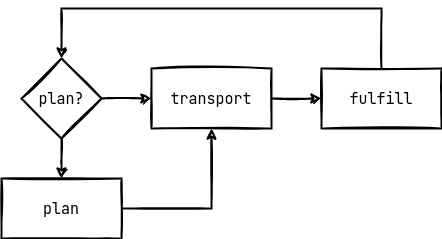
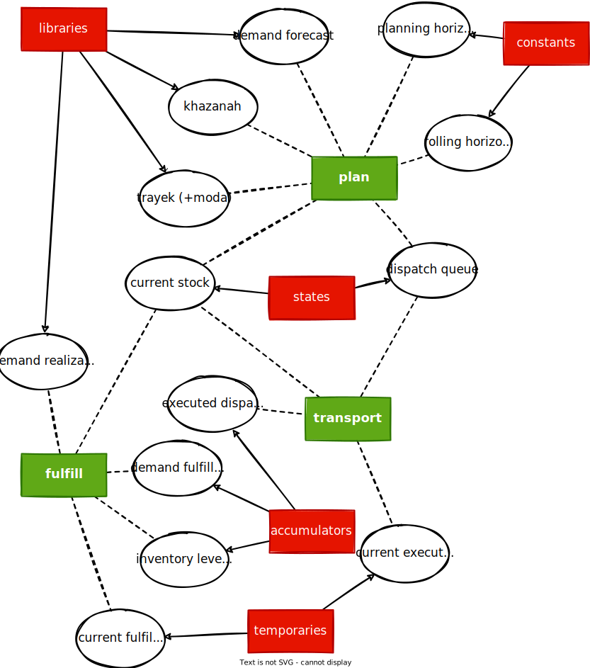

---
title: DESAIN SIMULASI - jurnal 1 April 2022
...
20220401093919

# simulation model
urgent parah hubugannya sama [[20220317155345]] simulasi

## event groups
there are three event group:
1. plan
    - create dispatch sequence for **T** time unit ahead of **current clock** using **current stock**, **khazanah lib**, **trayek lib**, and **demand forecast lib**
    - extract dispatch sequence starting from **current clock** for **rolling horizon** time unit and add it to **dispatch queue**
2. transport
    - filter the dispatch to be executed for **current clock** from the **dispatch queue** and remove filtered dispatch from the **dispatch queue** 
    - update **current stock** given the dispatch executed (will need temporary bucket for current executed dispatch) and add them to the **executed dispatch**
3. fulfill
    - given **current stock** and **demand realization lib** create the fulfillment flow and add it to **fulfillment list**
    - update **current stock** given the fulfillment flow (will need temporary bucket for current fulfillment flow)
    - add the **current stock** to the **inventory levels** list


## simulation components
we devised five core component groups following [@law1991] of the simulation which is:
- states 
- accumulators
- constants
- libraries
- temporaries

each has their own component as depicted below:


## component datatypes
where each of their datatypes will be stated as below:
| component                 | group        | datatype    |
|---------------------------|--------------|-------------|
| demand forecast           | libraries    | DataFrame   |
| demand realization        | libraries    | DataFrame   |
| khazanah                  | libraries    | DataFrame   |
| trayek (+moda)            | libraries    | DataFrame   |
| current stock             | states       | DataFrame   |
| dispatch queue            | states       | MetaDigraph |
| planning horizon          | constants    | Int         |
| rolling horizon           | constants    | Int         |
| executed dispatch         | accumulators | MetaDigraph |
| inventory levels          | accumulators | DataFrame   |
| demand fulfillment        | accumulators | DataFrame   |
| current executed dispatch | temporaries  | MetaDigraph |
| current fulfillment flow  | temporaries  | MetaDigraph |

## initialization routine

- load libraries : khazanah, trayek (+moda), demand forecast, demand realization
- load accumulators: executed dispatch, inventory levels, demand fulfillment
- load states: dispatchqueue, current stock
- emulating the fulfillment phase with some adjustments. fulfill (for initialization):
    - [SKIPPED] given **current stock** and **demand realization lib** create the fulfillment flow and add it to **fulfillment list** => but currently no demand to be realized, jdi skipped
    - [SKIPPED] update **current stock** given the fulfillment flow (will need temporary bucket for current fulfillment flow) => krn gaada yg perlu difulfill
    - [USED] add the **current stock** to the **inventory levels** list
- create event list (?)


## coret2 kode
a system is first defined by its states
```julia
mutable struct States
    current_stock::DataFrame
    dispatch_queue::MetaDigraph{locper}
end
```

libraries which are unchanged for the whole simulation
```julia
struct Libraries
    khazanah::DataFrame
    trayek::DataFrame
    demand_forecast::DataFrame
    demand_realization::DataFrame
end
```
buat inisiasi libraries, perlu dibikin fungsi `Libraries(path_to_lib::String, fn_realization::Function)` di mana nnti akan dibaca semua csv yg relevan buat libraries (khazanah, trayek, demand_forecast) dan akan dibikin demand realization pake si fn_realization.

fn_realization takes in a dataframe of forecasted demand and adds uncertainty to it as a realization of the real demand gitu deh. salah satu kandidatnya adalah `noisify(df, param)` single param realization
```julia
noisify(df, param) = DataFrame(
    id = df.id,
    periode = df.periode,
    pecahan = df.pecahan,
    value = df.value .+ rand([-param,param])
)
```
fungsi kyk gini advantage-nya adalah satu nilai param akan selalu ada di nila L1-norm yang konstan jdi klo nnti mau bandinginnya pake L1-norm jdi gampang.

accumulators that collects all information to be reported
```julia
mutable struct Accumulators
    executed_dispatch::MetaDigraph{locper}
    inventory_levels::DataFrame
    demand_fulfillment::DataFrame
end
```

constants are like libraries but are not datas
```julia
struct Constants
    T::Int
    C::Int
end
```

temporaries will be defined inside each code for each event group.

The whole simulation will also need a termination point. Idk about scheduler si sbnrny kira2 gimana ya.
```julia
mutable struct Simulation
    sta::States
    lib::Libraries
    acc::Acumulators
    con::Constants
end # or something like this kli ya
```

intinya nnti bakal ada tiga fungsi yg ngotak-ngatik simulasinya, yaitu: `plan!(sim::Simulation, model::Function)`, `transport!(sim::Simulation)`, dan `fulfill!(sim::Simulation)`

buat `plan!` nnti harus didefine fungsi yg dipake buat ngeplannya dan hrs documented well terutama input dan outputnya, biar nnti klo mau diubah2 juga gampang.

terus ada `initiate!(sim::Simulation, path_to_library::String)` yg nge-initiate semua yg diperlukan dan nge-readData ke library buat mulai.


