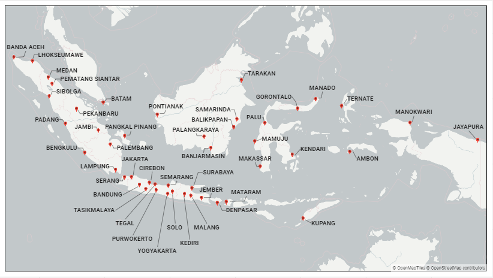

# PENDAHULUAN

ID: 20220317160430

## Latar Belakang

<!-- Tinjauan Sistem -->

Pengelolaan uang rupiah yang dilakukan Bank Indonesia merupakan sebuah rantai suplai di mana berlangsung enam (6) tahap daur hidup uang rupiah – perencanaan, pencetakan, pengeluaran, pengedaran, pencabutan/penarikan, serta pemusnahan – untuk menyediakan uang rupiah dengan jumlah nominal cukup, jenis pecahan sesuai, tepat waktu, dan kondisi layak edar. Aktivitas pengedaran terjadi lewat jaringan logistik berupa kumpulan trayek transportasi multimoda yang memungkinkan dan bersamaan membatasi pergerakan uang rupiah antara titik-titik penyimpanan kas Bank Indonesia – atau biasa disebut khazanah – yang persebarannya dapat dilihat pada [Gambar xx](./khazanah_bank_indonesia.png). Jaringan logistik ini dioperasionalisasikan oleh Departemen Pengedaran Uang (DPU) yang mengoordinasikan pengiriman (remis) uang dari pusat ke seluruh lokasi dan pengembalian (retur) uang dari seluruh lokasi ke pusat.

<!-- Proses Perencanaan -->

Di setiap unit periode yang ditetapkan, DPU membuat Rencana Distribusi Uang (RDU) untuk menjamin ketersediaan inventori di tiap khazanah di daerah operasi. Rencana distribusi ini merupakan susunan #pengiriman untuk unit periode tersebut di mana tiap pengiriman terdiri dari pasangan khazanah asal-tujuan, moda transportasi yang digunakan, besar muatan uang yang dikirimkan, serta kontainer – atau satuan pengepakan lain – yang dibutuhkan untuk mengenkapsulasi uang yang dikirimkan. Perencanaan yang dilakukan DPU saat ini menyerupai manajemen inventori konvensional, di mana para pelanggan – yang dalam kasus ini adalah khazanah-khazanah di daerah – memonitor sendiri tingkat persediaan mereka, menentukan sendiri kapan pengisian ulang harus dilakukan, dan menempatkan order pengisian ulang ke pemasok – yg dalam kasus ini adalah DPU. Pemasok menerima order tersebut, merencanakan transpor untuk mencapai biaya layanan terendah, dan melakukan pengantaran sesuai rencana. Namun, karena hubungan erat pengisian ulang dengan transportasi, dalam perencanaan macam ini, kontrol DPU terhadap utilisasi sumber daya jaringan logistik mendekati nihil.

<!-- Antitesis -->

Satu cara mengatasi kelemahan kontrol saat ini adalah adopsi konsep _vendor managed inventory_ yang mengacu pada situasi di mana pengisian ulang inventori (_inventory replenishment_) di sejumlah lokasi dikendalikan oleh pengambil keputusan pusat. Dalam konsep _vendor-managed inventory_, pemasok – atau DPU – memonitor tingkat persediaan di tiap-tiap pelanggan serta mengutilisasi pola permintaan yang harus dipenuhi pelanggan – atau khazanah di daerah – dan mengintegrasikan pengetahuan jaringan logistik untuk menentukan susunan pengiriman yang harus dilakukan. Alih-alih respons reaktif seiring tibanya order pelanggan, perencanaan proaktif seperti ini dapat: mendorong penurunan biaya total layanan melalui peningkatan frekuensi pengiriman _full truckload_ dan penurunan frekuensi pengiriman _less-than truckload_ serta  meningkatkan tingkat layanan melalui ketersediaan produk. Perencanaan distribusi macam ini dapat terlaksana sepenuhnya hanya jika pengambil keputusan pusat dapat dengan baik menggunakan informasi yang ada untuk secara konsisten menyelesaikan masalah pengendalian terintegrasi inventori dan transportasi.

## Rumusan Masalah

Perencanaan distribusi uang rupiah yang mengacu pada manajemen inventori konvensional tidak memberikan cukup ruang untuk optimasi sehingga dibutuhkan kerangka yang lebih baik. Dalam penelitian ini, dipelajari:

> Bagaimana konsep _vendor-managed inventory_ – melalui pengendalian terintegrasi inventori dan transportasi – dapat mengoperasionalisasikan distribusi uang rupiah Bank Indonesia secara optimal.

Operasionalisasi distribusi uang rupiah Bank Indonesia merupakan aktivitas yang menghasilkan Rencana Distribusi Uang (RDU) dan didefinisikan sebagai:

> Pencarian susunan pengiriman yang harus dilakukan secara konsisten dan kontinu tiap unit periode untuk memastikan persediaan pelanggan (khazanah) cukup untuk memenuhi permintaan uang rupiah serta meminimalkan biaya total layanan.

Sebagaimana didefinisikan pada bagian sebelumnya, #pengiriman terdiri dari pasangan khazanah asal-tujuan, moda transportasi yang digunakan, besar muatan uang yang dikirimkan, serta kontainer – atau satuan pengepakan lain – yang dibutuhkan untuk mengenkapsulasi uang yang dikirimkan.

## Tujuan dan Manfaat

Tujuan dari penelitian ini adalah menghasilkan, menguji, dan menganalisis model serta algoritma pengendalian inventori dan transportasi terintegrasi, sebagai penerapan konsep _vendor-managed inventory_, untuk operasionalisasi distribusi uang rupiah Bank Indonesia.

Beberapa manfaat yang diharapkan adalah bahwa:

- Skema yang dihasilkan dapat menjadi enjin pendukung keputusan pemangku kepentingan untuk menjalankan pengedara uang rupiah secara efektif dan efisien
- Pendekatan serta hasil yang digunakan dalam penelitian ini menjadi kontribusi yang berkenan untuk badan pengetahuan rantai suplai, penelitian operasional, serta badan pengetahuan terkait lainnya.

## Batasan dan Asumsi
Beberapa asumsi dalam penelitian ini adalah:
- Tingkat persediaan di seluruh khazanah Bank Indonesia dapat diakses oleh pengambil keputusan
- Tingkat persediaan dihitung di akhir periode setelah pengantaran dilakukan dan kebutuhan uang rupiah periode tersebut dipenuhi

Batasan dalam penelitian ini adalah:
- Penelitian terbatas pada sistem distribusi – namun dapat diekstensi ke sistem produksi
- Unit komoditas berupa peti yang merupakan hasil agregasi dari nilai rupiah tiap pecahan
- Implementasi tidak menjadi bagian dari penelitian

## Sistematika Penelitian