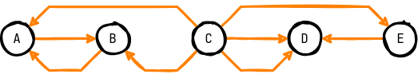
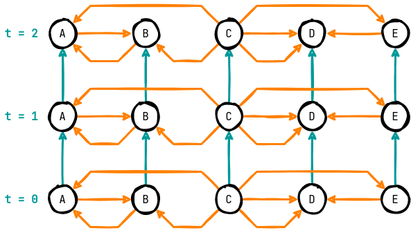
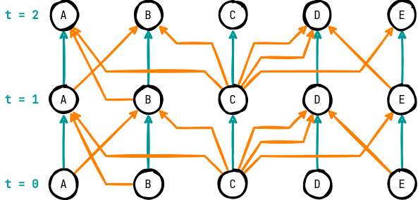
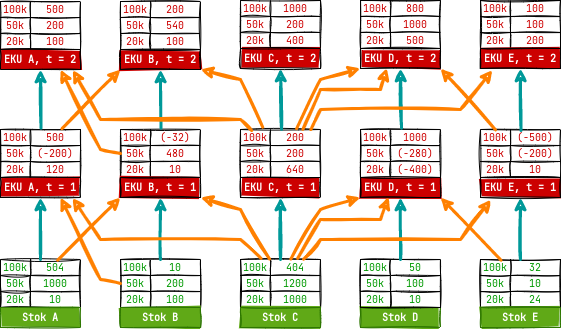
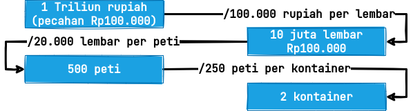
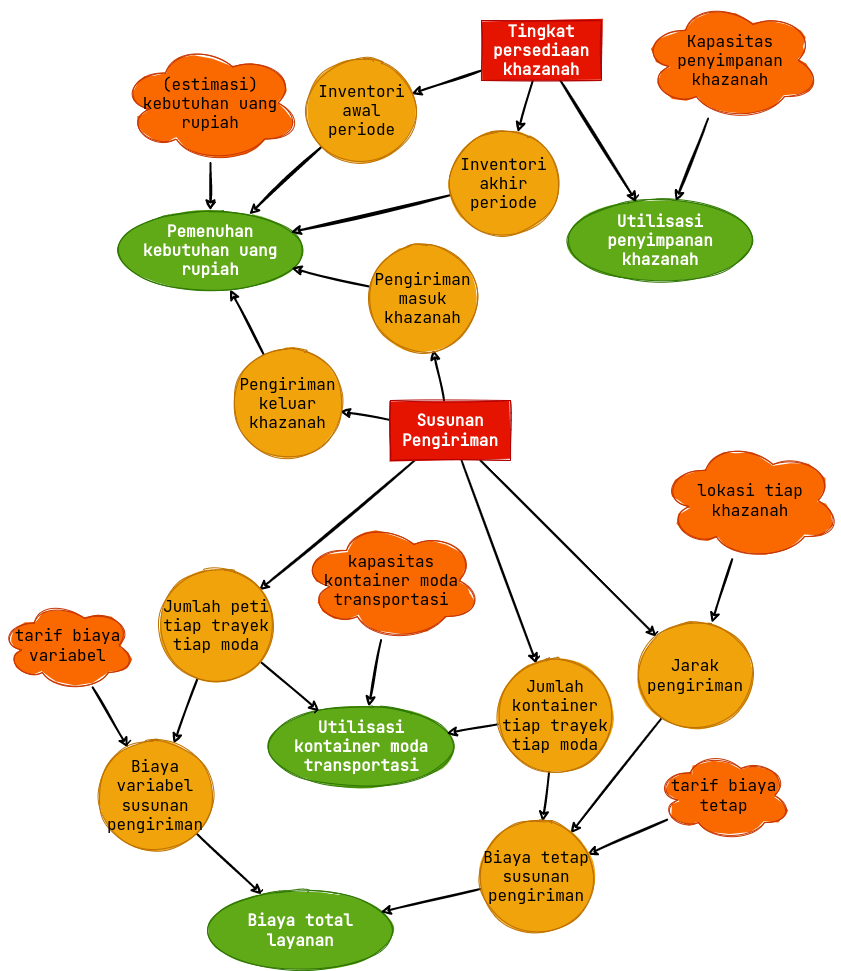

# HASIL DAN PEMBAHASAN

ID:20220317161039

## Pemahaman Masalah

Pada bagian ini, dikupas lebih dalam proses perencanaan distribusi uang rupiah serta dipetakan bagaimana inventori dan transportasi diintegrasikan dalam pengambilan keputusan. Pertama, diidentifikasi pemangku kepentingan dalam sistem. Kemudian, permasalahan distrukturkan menjadi elemen-elemennya. Terakhir, permasalahan dipertajam dengan bantuan diagram jaringan serta _influence diagram_.

### Analisis Pemangku Kepentingan

Pemangku kepentingan dalam sistem distribusi disajikan dalam `Tabel xx`. Peran dibagi menjadi empat, yaitu _problem owner_, _problem user_, _problem customer_
, dan _problem analyst_.

| Peran            | Entitas                                             |
| ---------------- | --------------------------------------------------- |
| Problem Owner    | DPU                                                 |
| Problem User     | DPU, penyedia moda transportasi, pengelola khazanah |
| Problem Customer | Bank komersial, masyarakat umum                     |
| Problem Analyst  | Peneliti                                            |

Sesuai dengan kemunculannya, pemilik masalah atau *problem owner* operasionalisasi distribusi adalah DPU di mana harus dapat dihasilkan rencana distribusi yang menjamin terpenuhinya kebutuhan masyarakat akan uang rupiah serta meminimalkan biaya total layanan. Selain itu, DPU juga merupakan petugas pelaksana rencana yang sudah dibuat dengan dibantu oleh penyedia moda transportasi serta pengelola khazanah di tempat masing-masing. Ketiga entitas ini masuk sebagai pengguna permasalahan atau *problem user* yang mengikuti arahan dari pemilik permasalahan. Terdapat empat penyedia moda transportasi rekanan Bank Indonesia, yaitu PT Selog (truk), PT Pelni (kapal penumpang), PT Silkargo (kapal barang), dan PT KAI (kereta api). Dampak dari kegagalan atau keberhasilan permasalahan ini adalah terjadinya kekurangan atau kelebihan uang rupiah yang beredar di bank-bank komersial dan masyarakat umum sebagai _problem customer_. Terakhir, terdapat peneliti sebagai *problem analyst* yang dengan tekun dan sabar membedah dan mengembangkan solusi untuk sistem. 

### Identifikasi Elemen Permasalahan

Dari rumusan masalah, pengintegrasian inventori dan transportasi untuk optimalisasi operasionalisasi distribusi dapat dipecah menjadi elemen-elemennya. Keenam elemen ini disajikan pada `Tabel xx`.

| Elemen              | Entitas                                                                                                                                                                                                                                                   |
| ------------------- | --------------------------------------------------------------------------------------------------------------------------------------------------------------------------------------------------------------------------------------------------------- |
| Pengambil Keputusan | DPU                                                                                                                                                                                                                                                       |
| Objektif            | Pengedaran uang optimal                                                                                                                                                                                                                                   |
| Ukuran Performa     | Biaya total layanan, pemenuhan kebutuhan uang rupiah, utilisasi jaringan logistik (moda transportasi dan gudang penyimpanan)                                                                                                                              |
| Kriteria Keputusan  | Minimal, fisibel (semua kebutuhan terpenuhi), fisibel (mengikuti kapasitas gudang dan kapasitas terkait transportasi)                                                                                                                                     |
| Alternatif Tindakan | Semua kemungkinan pasangan khazanah asal-tujuan, moda transportasi yang digunakan, besar muatan uang yang dikirimkan, serta kontainer – atau satuan pengepakan lain – yang dibutuhkan untuk mengenkapsulasi uang yang dikirimkan                          |
| Konteks             | *Narrow System of Interest*: sistem distribusi uang rupiah Bank Indonesia, *Wider System of Interest*: rantai suplai Bank Indonesia dengan produksi di PERURI, peramalan di Departemen Kebijakan Makroprudensial, beserta fungsi-fungsi lain yang terkait |

Seperti dijelaskan pada bagian sebelumnya, pengambil keputusan dalam tiap permasalahan perencanaan distribusi adalah DPU. Objektif dari DPU adalah pengedaran uang yang optimal di mana hal ini diukur dari biaya total layanan, pemenuhan kebutuhan uang rupiah, dan utilisasi jaringan logistik. Keoptimalan tercapai ketika ukuran-ukuran performa mencapai kriteria keputusan masing-masing. Alternatif DPU adalah semua kemungkinan pengantaran yang dapat dilakukan dalam sebuah periode. Pembuatan rencana distribusi ini merupakan bagian dari sistem distribusi uang rupiah – yang merupakan bagian dari rantai suplai secara keseluruhan.

| Deskriptor              | Deskripsi                                                                                                                                                                                                                                             |
| ----------------------- | ----------------------------------------------------------------------------------------------------------------------------------------------------------------------------------------------------------------------------------------------------- |
| Komponen Sistem         | Subsistem inventori dan transportasi                                                                                                                                                                                                                  |
| Aktivitas Sistem        | Perencanaan distribusi, koordinasi dengan penyedia moda transportasi, eksekusi pengiriman pengisian ulang uang, penerimaan pengisian ulang uang, pengedaran uang ke masyarakat, penerimaan uang kembali dari masyarakat                               |
| Hubungan Antarkomponen  | Subsistem inventori menentukan besar dan waktu pengisian ulang, subsistem transportasi melaksakan pengisian ulang, inventori menarik data tingkat persediaan untuk kemudian mengulang penentuan pengisian ulang                                       |
| Masukan dari Lingkungan | Estimasi kebutuhan uang rupiah, moda transportasi yang dapat digunakan beserta biaya-biaya terkait, tingkat persediaan di tiap-tiap khazanah (dari periode sebelumnya), kapasitas penyimpanan khazanah, kapasitas terkait kontainer moda transportasi |
| Keluaran ke Lingkungan  | Aliran net dari dan ke tiap-tiap khazanah serta aliran net uang rupiah dari dan ke masyarakat                                                                                                                                                         |
| Proses Transformasi     | Perencanaan dan eksekusi pengiriman uang rupiah dari informasi yang ada                                                                                                                                                                               |

Untuk memberikan resolusi lebih tinggi terkait sistem distribusi, diberikan detail deskripsi sistem pada `Tabel xx` di atas. Tabel ini diharapkan dapat memberikan pemahaman yang menyeluruh akan permasalahan dari sistem relevan.

### Pengembangan Diagram Sistem Relevan

Sistem dan permasalahannya merupakan sebuah jaringan. Trayek-trayek dari penyedia moda transportasi menghubungkan khazanah-khazanah Bank Indonesia dan menyusun jaringan tersebut. Jaringan ini digambarkan sebagai sebuah multigraf di mana terdapat busur-busur paralel karena ada lebih dari satu moda yang menghubungkan sepasang titik seperti pada `Gambar xx`. Pada gambar ini, jumlah titik dan trayek moda transportasi dikurangi untuk kepentingan visualisasi.

Namun, jaringan seperti ini tidaklah cukup untuk merepresentasikan masalah yang ingin diselesaikan karena tidak menangkap aspek waktu yang krusial dalam pengendalian inventori. Untuk dapat menangkap aspek waktu, jaringan di atas diekspansi seturut dengan periode waktu yang ingin ditelisik. Trayek yang menghubungkan antarkhazanah diduplikasi di setiap periode dan khazanah di setiap periode dihubungkan oleh busur di mana inventori mengalir – yang kita sebut busur inventori. Jaringan terekspansi ini dapat dilihat pada `Gambar xx`.

Meskipun sudah menginkorporasikan aspek temporal ke dalam representasi permasalahan, diagram jaringan ini mengasumsikan transportasi terjadi secara instan. Hal ini sulit dieksekusi dalam sistem distribusi bervolume besar seperti yang dilakukan oleh DPU sehingga dibentuk jaringan terekspansi dengan asumsi transportasi yang dimulai pada sebuah periode selesai tepat sebelum periode berikutnya dimulai. Konsep durasi pengiriman dapat diatur sedemikian rupa untuk mengakomodasi waktu pengiriman yang beragam, namun untuk masalah ini digunakan durasi pengiriman sebesar satu unit periode. Jaringan terekspansi ini dapat dilihat pada `Gambar xx`.

Di setiap khazanah pada setiap periode, terdapat Estimasi Kebutuhan Uang (EKU) yang harus dipenuhi oleh DPU. Estimasi ini terbagi-bagi untuk tiap pecahan uang kartal di mana terdapat tujuh (7) pecahan uang kertas dan lima (5) pecahan uang logam. Estimasi ini merupakan kombinasi _outflow_ dan _inflow_ dengan nilai positif melambangkan uang rupiah keluar ke masyarakat. Mungkin terdapat aliran bernilai negatif di saat aliran masuk dari masyarakat lebih besar daripada uang rupiah yang dialirkan keluar. Selain itu, di awal periode, DPU memiliki data terkait tingkat persediaan tiap pecahan di setiap lokasi. Rencana distribusi yang dibuat dalam permasalahan ini nantinya harus bisa memenuhi baik aliran keluar atau aliran masuk kembali ke khazanah. Jaringan dengan data persediaan dan estimasi kebutuhan uang yang harus dipenuhi dapat dilihat pada `Gambar xx`.

Beberapa hal yang penting untuk dicatat namun tidak dapat terlihat dalam diagram di atas adalah bagaimana uang rupiah mengalir dalam jaringan tersebut. Pertama, tiap-tiap pecahan uang rupiah akan dikemas dalam peti-peti uang. Konversi yang diberikan DPU adalah bahwa satu (1) peti dapat memuat 20.000 lembar uang kertas atau 5.000 keping uang logam. Kemudian, kumpulan-kumpulan peti ini dikemas oleh kontainer tiap-tiap moda yang memiliki kapasitas-kapasitas berbeda. Hal ini nantinya berpengaruh pada fungsi biaya tiap pengantaran karena kontainer dianggap sebagai sebuah biaya tetap untuk tiap pengantaran. Terdapat contoh konversi yang diilustrasikan pada `Gambar xx`. Pada contoh ini, moda kendaraan dapat menampung 250 peti uang.

Untuk menggambarkan hubungan antarelemen permasalahan yang diselesaikan di setiap titik pada setiap periode, dibangun _influence diagram_. Untuk konstruksinya, elemen-elemen permasalahan yang sudah ada dikelompokkan sesuai dengan komponen-komponen dari _influence diagram_ itu sendiri. Pengelompokan ini terdapat pada `Tabel xx`.

| Kelompok               | Anggota                                                                                                                                                                                                                                                                                                                                             |
|------------------------|-----------------------------------------------------------------------------------------------------------------------------------------------------------------------------------------------------------------------------------------------------------------------------------------------------------------------------------------------------|
| Masukan Terkontrol     | Pasangan khazanah asal-tujuan, moda transportasi yang digunakan, besar muatan uang yang dikirimkan, serta kontainer – atau satuan pengepakan lain – yang dibutuhkan untuk mengenkapsulasi uang yang dikirimkan                                                                                                                                      |
| Masukan Tak Terkontrol | Kapasitas kontainer moda pengiriman, lokasi khazanah, kapasitas khazanah penyimpanan, komponen biaya tetap dan komponen biaya variabel moda transportasi, estimasi kebutuhan uang rupiah, persediaan di khazanah (dari periode sebelumnya)                                                                                                          |
| Keluaran               | Biaya total layanan, pemenuhan kebutuhan uang rupiah, utilisasi kontainer moda transportasi, utilisasi penyimpanan khazanah                                                                                                                                                                                                                         |
| Variabel Sistem        | Total pengiriman masuk ke setiap titik setiap periode, total pengiriman keluar setiap titik setiap periode, inventori akhir setiap titik setiap periode, inventori awal setiap titik setiap periode, biaya tetap susunan pengiriman setiap periode, biaya variabel susunan pengiriman setiap periode, biaya total susunan pengiriman setiap periode |

Pada _influence diagram_ di `Gambar xx` ini dinyatakan bahwa yang ada dalam kendali pengambil keputusan adalah konfigurasi level inventori serta susunan pengiriman. Susunan pengiriman dan tingkat persediaan yang diimplikasikan oleh pengiriman tersebut kemudian akan memenuhi kebutuhan uang rupiah di mana hal terpenting adalah fisibel atau tidaknya pemenuhan tersebut. Tingkat persediaan yang diputuskan harus berada di bawah kapasitas penyimpanan khazanah di mana selisih tingkat persediaan tiap saat dengan kapasitas penyimpanan selalu di bawah nol nilainya. Selain itu, jumlah kontainer harus berbanding dengan jumlah peti yang diangkut seturut dengan kapasitas kontainer tiap-tiap moda. Nantinya, jumlah kontainer dan jumlah peti yang diimplikasikan akan menentukan biaya tiap pengantaran bersama dengan jarak pengiriman, tarif biaya tetap, dan tarif biaya variabel.

Dengan _influence diagram_, hasil ekstraksi pemahaman masalah yang dilakukan peneliti selesai dieksposisi. Pada bagian ini sudah disajikan analisis pemangku kepentingan, identifikasi elemen permasalahan, serta diagram sistem relevan di mana terdapat dua diagram, yaitu diagram jaringan terekspansi serta _influence diagram_.

## Formulasi Model

### Penyusunan Model

konsep dasar model:

- model deterministik + why
- direct shipping strategy + why [@custodio2006] pg 10/21
- penggunaan forecast + why
- pemrograman bilangan bulat
- lebih spesifik lagi, strukturnya mirip min cost multicommodity network flow
eksposisi model:
- list persamaan2nya

$$
\begin{array}{rrcll}
\text{min}  & \displaystyle \sum_{a \in A} \bigg[ v_{a} \cdot \sum_{p \in P} x_{a}^{p} + f_a \cdot dist_a \cdot y_{a} \bigg] \\
\text{s.t.} & \displaystyle \sum_{a \in \text{IN}(n)} x_{a}^{p} - \sum_{a \in \text{OUT}(n)} x_{a}^{p} & = & d_{n}^{p} 
                                                                       & \forall n \in N, p \in P \\
     & \displaystyle \sum_{p \in P}x_{a}^{p} & \leq & Q_a \cdot y_a    & \forall a \in A \\
     & \displaystyle x_{a}^{p} & \in & \mathbb{R}^{+}                  & \forall a \in A, p \in P \\
     & \displaystyle y_{a} & \in & \left{ 0,1 \right}                           & \forall a \in A_{inv} \\
     & \displaystyle y_{a} & \in & \mathbb{N}^0                        & \forall a \in A_{trans}
\end{array}
$$

### Verifikasi Model

tabel konversi satuan

## Pengembangan Prosedur Pencarian Solusi

### Implementasi Algoritma

pola dasar algoritma:

- dari jenis model: pemrograman integer => relaksasi (simpleks) + branch and cut → teknik dasar algoritma
- dari ukuran permasalahan: sifat optimasinya aproksimasi (kasih _rule_ aproksimasi) → sifat optimasi
perangkat komputasi:
- hardware: spek komputer → digunakan komputer karena ukuran permasalahan
- software: Julia Mathematical Programming (JuMP) + Gurobi diprogram dengan bahasa pemrograman julia → krn jenis modelnya
struktur data:
- tabel-tabel libs init (khazanah moda trayek demand_forecast)
- transformasi-transformasi dr data ke model (hubungan data dengan variabel yg mau dibuat)
eksposisi algoritma:
- pseudocode algoritma

### Verifikasi Algortima

test cases:

- zero demand => zero transport
- single stock supplier, multiple demand location, same cost, same distance => break bulk
- multiple stock supplier, single demand location, same cost, same distance => consolidate
- not enough stock => infeasible
- emulate frontloading

## Pengujian, Analisis, dan Perbaikan Model

### Validasi Model

### Analisis Sensitivitas

### Analisis Struktur Jaringan

### Analisis Horizon Perencanaan

### Analisis Akurasi Ramalan

### Analisis Implikasi Manajerial

## Pengumpulan Data

Sumber Data:

- Rekapitulasi OIP EKU (2019)
- Rekapitulasi Biaya Remise KDK (2017)
- Rekapitulasi Biaya Remise DPU (2017)
- Rute Kapal Barang Sesuai Kontrak (2015)
- Rute Kapal Penumpang Sesuai Kontrak (2015)
- Rute Kereta Api Sesuai Kontrak (2015)
- Kapasitas Khazanah Terpasang (2016)
- Lokasi Tiap Khazanah
- Laporan Pelaksanaan Tugas dan Wewenang Bank Indonesia (2019)

Kebutuhan Data:

- demand forecast (dalam peti)
  - struktur data final (kolom yang diminta/refer ke eksposisi struktur data): i - t - value
  - dokumen input: Rekapitulasi OIP EKU (2019)
  - proses transformasi: konversi rupiah ke lembar tiap pecahan, konversi unit pecahan (lembar/keping) ke peti
- demand realization (dalam peti): merupakan dokumen turunan dari demand forecast untuk kebutuhan simulasi
  - struktur data final sama dengan demand forecast: i- t - value
  - dokumen input: demand forecast
  - proses transformasi: dibuat dua jenis fungsi transformasi yang menggunakan parameter tunggal. Fungsi-fungsi dibuat sedemikian rupa sehingga akan menghasilkan jarak Norma L1 atau Norma Manhattan yang sama untuk nilai parameter tunggal yang sama. Hal ini dilakukan untuk memudahkan pengelompokan realisasi permintaan peti uang dalam pengujian-pengujian yang dilakukan.
    - noisify_fixed: penggunaan simpangan yg bersifat konstan pada tiap entri estimasi permintaan. (eksposisi fungsinya)
    - noisify_varied: penggunaan simpangan yang bersifat proporsional terhadap tiap entri estimasi permintaan. (eksposisi fungsinya)
- stok awal (dalam peti):
  - struktur data final (kolom yang diminta/refer ke eksposisi struktur data)
  - dokumen input: sama dengan demand forecast
  - proses transformasi: sama dengan demand forecast
- trayek aktual:
  - struktur data final: u - v - moda
  - dokumen input:
    - Rekapitulasi Biaya Remise KDK (2017)
    - Rekapitulasi Biaya Remise DPU (2017)
  - proses transformasi: filter unique
- trayek usulan
  - struktur data final: u - v - moda
  - dokumen input: sama dengan trayek aktual dengan tambahan
    - sama dengan trayek aktual
    - Rute Kapal Barang Sesuai Kontrak (2015)
    - Rute Kapal Penumpang Sesuai Kontrak (2015)
    - Rute Kereta Api Sesuai Kontrak (2015)
  - proses transformasi: agregasi semua data
- parameter biaya moda transportasi:
  - struktur data final: nama - kapasitas - biaya variabel (/peti) - biaya tetap (/kontainer * km)
  - dokumen input:
    - Rekapitulasi Biaya Remise KDK (2017)
    - Rekapitulasi Biaya Remise DPU (2017)
  - proses transformasi: regresi linear dari data pengiriman tiap moda, didapatkan hasil sebagai berikut: _penyajian hasil_

Regresi dilakukan dengan melakukan minimasi terhadap kuadrat selisih tiap observasi pengiriman dengan prediktor biaya – yang merupakan hasil kali biaya variabel tiap moda dengan peti yang diangkut dijumlahkan dengan biaya tetap dikalikan jarak serta jumlah kontainer yang digunakan – sebagai berikut:

$$
\text{min } \sum_{r \in rekap} \bigg[ cost_r - \sum_{m \in moda} moda_{rm} \big( var_m \cdot peti_r + fix_m \cdot distance_r \cdot container_r \big) \bigg] ^2
$$

Di sini $moda_{rm}$ merupakan variabel penanda apakah baris $r$ dari hasil rekap pengedaran menggunakan moda $m$. Selain itu, dipastikan nilai biaya variabel serta biaya tetap selalu merupakan bilangan non-negatif:

$$
\begin{aligned}
var_m \geq 0, \forall m \in moda \\
fix_m \geq 0, \forall m \in moda
\end{aligned}
$$

Didapatkan nilai $R^2$ sebesar 96.48% dengan hasil regresi untuk tiap moda sebagai berikut:

| Moda / _m_      | Biaya Variabel / _var_ | Biaya Tetap / _fix_ |
| --------------- | ---------------------- | ------------------- |
| Truk            | Rp2.100                | Rp33.254            |
| Kapal Penumpang | Rp81.914               | Rp32.781            |
| Kapal Barang    | Rp48.272               | Rp43.293            |
| Kereta Api      | Rp49.189               | Rp127.974           |

Satuan biaya variabel berlaku untuk tiap peti dan biaya tetap berlaku untuk tiap kilometer tiap kontainer.

- khazanah -> agregasi set data: menggabungkan data terkait tiap khazanah, yaitu: lokasi berupa koordinat lintang bujur dan kapasitas penyimpanan.
- tingkat aktivitas distribusi uang tahun 2019: dari laporan ini hanya dapat diekstrak realisasi agregat kebutuhan uang di Indonesia tiap pecahan, serta jumlah pengiriman tercatat serta jumlah uang yang terpindahkan.
