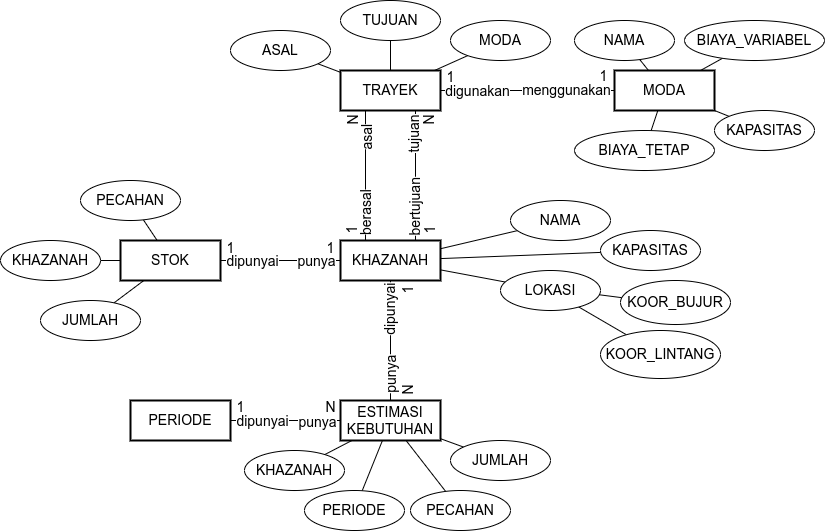

# HASIL DAN PEMBAHASAN

ID:20220317161039

## Pemahaman Masalah

Pada bagian ini, dikupas lebih dalam proses perencanaan distribusi uang rupiah serta dipetakan bagaimana inventori dan transportasi diintegrasikan dalam pengambilan keputusan. Pertama, diidentifikasi pemangku kepentingan dalam sistem. Kemudian, permasalahan distrukturkan menjadi elemen-elemennya. Terakhir, permasalahan dipertajam dengan bantuan diagram jaringan serta _influence diagram_.

### Analisis Pemangku Kepentingan

Pemangku kepentingan dalam sistem distribusi disajikan dalam `Tabel xx`. Peran dibagi menjadi empat, yaitu _problem owner_, _problem user_, _problem customer_
, dan _problem analyst_.

| Peran            | Entitas                                             |
| ---------------- | --------------------------------------------------- |
| Problem Owner    | DPU                                                 |
| Problem User     | DPU, penyedia moda transportasi, pengelola khazanah |
| Problem Customer | Bank komersial, masyarakat umum                     |
| Problem Analyst  | Peneliti                                            |

Sesuai dengan kemunculannya, pemilik masalah atau *problem owner* operasionalisasi distribusi adalah DPU di mana harus dapat dihasilkan rencana distribusi yang menjamin terpenuhinya kebutuhan masyarakat akan uang rupiah serta meminimalkan biaya total layanan. Selain itu, DPU juga merupakan petugas pelaksana rencana yang sudah dibuat dengan dibantu oleh penyedia moda transportasi serta pengelola khazanah di tempat masing-masing. Ketiga entitas ini masuk sebagai pengguna permasalahan atau *problem user* yang mengikuti arahan dari pemilik permasalahan. Terdapat empat penyedia moda transportasi rekanan Bank Indonesia, yaitu PT Selog (truk), PT Pelni (kapal penumpang), PT Silkargo (kapal barang), dan PT KAI (kereta api). Dampak dari kegagalan atau keberhasilan permasalahan ini adalah terjadinya kekurangan atau kelebihan uang rupiah yang beredar di bank-bank komersial dan masyarakat umum sebagai _problem customer_. Terakhir, terdapat peneliti sebagai *problem analyst* yang dengan tekun dan sabar membedah dan mengembangkan solusi untuk sistem. 

### Identifikasi Elemen Permasalahan

Dari rumusan masalah, pengintegrasian inventori dan transportasi untuk optimalisasi operasionalisasi distribusi dapat dipecah menjadi elemen-elemennya. Keenam elemen ini disajikan pada `Tabel xx`.

| Elemen              | Entitas                                                                                                                                                                                                                                                   |
| ------------------- | --------------------------------------------------------------------------------------------------------------------------------------------------------------------------------------------------------------------------------------------------------- |
| Pengambil Keputusan | DPU                                                                                                                                                                                                                                                       |
| Objektif            | Pengedaran uang optimal                                                                                                                                                                                                                                   |
| Ukuran Performa     | Biaya total layanan, pemenuhan kebutuhan uang rupiah, utilisasi jaringan logistik (moda transportasi dan gudang penyimpanan)                                                                                                                              |
| Kriteria Keputusan  | Minimal, fisibel (semua kebutuhan terpenuhi), fisibel (mengikuti kapasitas gudang dan kapasitas terkait transportasi)                                                                                                                                     |
| Alternatif Tindakan | Semua kemungkinan pasangan khazanah asal-tujuan, moda transportasi yang digunakan, besar muatan uang yang dikirimkan, serta kontainer – atau satuan pengepakan lain – yang dibutuhkan untuk mengenkapsulasi uang yang dikirimkan                          |
| Konteks             | *Narrow System of Interest*: sistem distribusi uang rupiah Bank Indonesia, *Wider System of Interest*: rantai suplai Bank Indonesia dengan produksi di PERURI, peramalan di Departemen Kebijakan Makroprudensial, beserta fungsi-fungsi lain yang terkait |

Seperti dijelaskan pada bagian sebelumnya, pengambil keputusan dalam tiap permasalahan perencanaan distribusi adalah DPU. Objektif dari DPU adalah pengedaran uang yang optimal di mana hal ini diukur dari biaya total layanan, pemenuhan kebutuhan uang rupiah, dan utilisasi jaringan logistik. Keoptimalan tercapai ketika ukuran-ukuran performa mencapai kriteria keputusan masing-masing. Alternatif DPU adalah semua kemungkinan pengantaran yang dapat dilakukan dalam sebuah periode. Pembuatan rencana distribusi ini merupakan bagian dari sistem distribusi uang rupiah – yang merupakan bagian dari rantai suplai secara keseluruhan.

| Deskriptor              | Deskripsi                                                                                                                                                                                                                                             |
| ----------------------- | ----------------------------------------------------------------------------------------------------------------------------------------------------------------------------------------------------------------------------------------------------- |
| Komponen Sistem         | Subsistem inventori dan transportasi                                                                                                                                                                                                                  |
| Aktivitas Sistem        | Perencanaan distribusi, koordinasi dengan penyedia moda transportasi, eksekusi pengiriman pengisian ulang uang, penerimaan pengisian ulang uang, pengedaran uang ke masyarakat, penerimaan uang kembali dari masyarakat                               |
| Hubungan Antarkomponen  | Subsistem inventori menentukan besar dan waktu pengisian ulang, subsistem transportasi melaksakan pengisian ulang, inventori menarik data tingkat persediaan untuk kemudian mengulang penentuan pengisian ulang                                       |
| Masukan dari Lingkungan | Estimasi kebutuhan uang rupiah, moda transportasi yang dapat digunakan beserta biaya-biaya terkait, tingkat persediaan di tiap-tiap khazanah (dari periode sebelumnya), kapasitas penyimpanan khazanah, kapasitas terkait kontainer moda transportasi |
| Keluaran ke Lingkungan  | Aliran net dari dan ke tiap-tiap khazanah serta aliran net uang rupiah dari dan ke masyarakat                                                                                                                                                         |
| Proses Transformasi     | Perencanaan dan eksekusi pengiriman uang rupiah dari informasi yang ada                                                                                                                                                                               |

Untuk memberikan resolusi lebih tinggi terkait sistem distribusi, diberikan detail deskripsi sistem pada `Tabel xx` di atas. Tabel ini diharapkan dapat memberikan pemahaman yang menyeluruh akan permasalahan dari sistem relevan.

### Pengembangan Diagram Sistem Relevan

Sistem dan permasalahannya merupakan sebuah jaringan. Trayek-trayek dari penyedia moda transportasi menghubungkan khazanah-khazanah Bank Indonesia dan menyusun jaringan tersebut. Jaringan ini digambarkan sebagai sebuah multigraf di mana terdapat busur-busur paralel karena ada lebih dari satu moda yang menghubungkan sepasang titik seperti pada `Gambar xx`. Pada gambar ini, jumlah titik dan trayek moda transportasi dikurangi untuk kepentingan visualisasi.

Namun, jaringan seperti ini tidaklah cukup untuk merepresentasikan masalah yang ingin diselesaikan karena tidak menangkap aspek waktu yang krusial dalam pengendalian inventori. Untuk dapat menangkap aspek waktu, jaringan di atas diekspansi seturut dengan periode waktu yang ingin ditelisik. Trayek yang menghubungkan antarkhazanah diduplikasi di setiap periode dan khazanah di setiap periode dihubungkan oleh busur di mana inventori mengalir – yang kita sebut busur inventori. Jaringan terekspansi ini dapat dilihat pada `Gambar xx`.

Meskipun sudah menginkorporasikan aspek temporal ke dalam representasi permasalahan, diagram jaringan ini mengasumsikan transportasi terjadi secara instan. Hal ini sulit dieksekusi dalam sistem distribusi bervolume besar seperti yang dilakukan oleh DPU sehingga dibentuk jaringan terekspansi dengan asumsi transportasi yang dimulai pada sebuah periode selesai tepat sebelum periode berikutnya dimulai. Konsep durasi pengiriman dapat diatur sedemikian rupa untuk mengakomodasi waktu pengiriman yang beragam, namun untuk masalah ini digunakan durasi pengiriman sebesar satu unit periode. Jaringan terekspansi ini dapat dilihat pada `Gambar xx`.

Di setiap khazanah pada setiap periode, terdapat Estimasi Kebutuhan Uang (EKU) yang harus dipenuhi oleh DPU. Estimasi ini terbagi-bagi untuk tiap pecahan uang kartal di mana terdapat tujuh (7) pecahan uang kertas dan lima (5) pecahan uang logam. Estimasi ini merupakan kombinasi _outflow_ dan _inflow_ dengan nilai positif melambangkan uang rupiah keluar ke masyarakat. Mungkin terdapat aliran bernilai negatif di saat aliran masuk dari masyarakat lebih besar daripada uang rupiah yang dialirkan keluar. Selain itu, di awal periode, DPU memiliki data terkait tingkat persediaan tiap pecahan di setiap lokasi. Rencana distribusi yang dibuat dalam permasalahan ini nantinya harus bisa memenuhi baik aliran keluar atau aliran masuk kembali ke khazanah. Jaringan dengan data persediaan dan estimasi kebutuhan uang yang harus dipenuhi dapat dilihat pada `Gambar xx`.

Beberapa hal yang penting untuk dicatat namun tidak dapat terlihat dalam diagram di atas adalah bagaimana uang rupiah mengalir dalam jaringan tersebut. Pertama, tiap-tiap pecahan uang rupiah akan dikemas dalam peti-peti uang. Konversi yang diberikan DPU adalah bahwa satu (1) peti dapat memuat 20.000 lembar uang kertas atau 5.000 keping uang logam. Kemudian, kumpulan-kumpulan peti ini dikemas oleh kontainer tiap-tiap moda yang memiliki kapasitas-kapasitas berbeda. Hal ini nantinya berpengaruh pada fungsi biaya tiap pengantaran karena kontainer dianggap sebagai sebuah biaya tetap untuk tiap pengantaran. Terdapat contoh konversi yang diilustrasikan pada `Gambar xx`. Pada contoh ini, moda kendaraan dapat menampung 250 peti uang.

Untuk menggambarkan hubungan antarelemen permasalahan yang diselesaikan di setiap titik pada setiap periode, dibangun _influence diagram_. Untuk konstruksinya, elemen-elemen permasalahan yang sudah ada dikelompokkan sesuai dengan komponen-komponen dari _influence diagram_ itu sendiri. Pengelompokan ini terdapat pada `Tabel xx`.

| Kelompok               | Anggota                                                                                                                                                                                                                                                                                                                                             |
| ---------------------- | --------------------------------------------------------------------------------------------------------------------------------------------------------------------------------------------------------------------------------------------------------------------------------------------------------------------------------------------------- |
| Masukan Terkontrol     | Pasangan khazanah asal-tujuan, moda transportasi yang digunakan, besar muatan uang yang dikirimkan, serta kontainer – atau satuan pengepakan lain – yang dibutuhkan untuk mengenkapsulasi uang yang dikirimkan                                                                                                                                      |
| Masukan Tak Terkontrol | Kapasitas kontainer moda pengiriman, lokasi khazanah, kapasitas khazanah penyimpanan, komponen biaya tetap dan komponen biaya variabel moda transportasi, estimasi kebutuhan uang rupiah, persediaan di khazanah (dari periode sebelumnya)                                                                                                          |
| Keluaran               | Biaya total layanan, pemenuhan kebutuhan uang rupiah, utilisasi kontainer moda transportasi, utilisasi penyimpanan khazanah                                                                                                                                                                                                                         |
| Variabel Sistem        | Total pengiriman masuk ke setiap titik setiap periode, total pengiriman keluar setiap titik setiap periode, inventori akhir setiap titik setiap periode, inventori awal setiap titik setiap periode, biaya tetap susunan pengiriman setiap periode, biaya variabel susunan pengiriman setiap periode, biaya total susunan pengiriman setiap periode |

Pada _influence diagram_ di `Gambar xx` ini dinyatakan bahwa yang ada dalam kendali pengambil keputusan adalah konfigurasi level inventori serta susunan pengiriman. Susunan pengiriman dan tingkat persediaan yang diimplikasikan oleh pengiriman tersebut kemudian akan memenuhi kebutuhan uang rupiah di mana hal terpenting adalah fisibel atau tidaknya pemenuhan tersebut. Tingkat persediaan yang diputuskan harus berada di bawah kapasitas penyimpanan khazanah di mana selisih tingkat persediaan tiap saat dengan kapasitas penyimpanan selalu di bawah nol nilainya. Selain itu, jumlah kontainer harus berbanding dengan jumlah peti yang diangkut seturut dengan kapasitas kontainer tiap-tiap moda. Nantinya, jumlah kontainer dan jumlah peti yang diimplikasikan akan menentukan biaya tiap pengantaran bersama dengan jarak pengiriman, tarif biaya tetap, dan tarif biaya variabel.

Dengan _influence diagram_, hasil ekstraksi pemahaman masalah yang dilakukan peneliti selesai dieksposisi. Pada bagian ini sudah disajikan analisis pemangku kepentingan, identifikasi elemen permasalahan, serta diagram sistem relevan di mana terdapat dua diagram, yaitu diagram jaringan terekspansi serta _influence diagram_.

## Formulasi Model
Ditemukan bahwa permasalahan yang diselesaikan menyerupai _fixed-charge minimum cost multicommodity network flow problem_. Permasalahan ini berurusan dengan mengalirkan lebih dari satu komoditas dari sumber-sumbernya ke tujuan-tujuannya melewati busur-busur yang tidak hanya mengenakan biaya untuk jumlah muatan yang lewat, tetapi pada penggunaan tiap-tiap busur juga. Permasalahan ini termasuk permasalahan jaringan yang bersifat kombinatorial dan diskret.

### Penyusunan Model
Graf terarah jaringan dasar $D = (V,E)$ terdiri dari kumpulan khazanah $V$ dihubungkan oleh kumpulan trayek $E = \{(i,j,m) : (i,j) \in V^2, m \in M\}$ di mana $M$ adalah kumpulan moda yang tersedia bagi DPU. Tiap moda memiliki parameter biaya tetap $fix_m$, biaya variabel $var_m$, dan kapasitas kontainer moda $Q_m$ masing-masing. Untuk tiap khazanah $i \in V$, diketahui besar kapasitas penyimpanan $CAP_i$ serta lokasi masing-masing khazanah sehingga dapat dikalkulasi jarak antarkhazanah $dist(i,j)$ sebuah trayek $e \in E$. Permasalahan ini didefinisikan di atas sebuah multigraf terarah $G(H) = (N,A)$ yang merupakan hasil ekspansi jaringan dasar $D$ sepanjang $H$ periode perencanaan yang biasa disebut horizon perencanaan. #base-graph-digraph

Dalam multigraf ini, $N$ merepresentasikan seluruh khazanah di tiap periode perencanaan yang terbagi menjadi tiga kelompok $N = N_{init} \cup N_{plan} \cup N_{sink}$ di mana $N_{init} = \{(i,0):i\in V\}$ merepresentasikan khazanah di saat ini atau saat perencanaan sedang dilakukan, $N_{plan} = \{(i,t) : i \in V, t\in [1, \dots ,H]\}$ merepresentasikan khazanah di sepanjang periode perencanaan, dan $N_{sink} = \{(i,H+1): i \in V\}$ untuk merepresentasikan simpul _dummy_ tempat aliran komoditas berakhir. #node-def

Busur-busur yang menghubungkan elemen-elemen dalam $N$ direpresentasikan oleh $A = A_{inv} \cup A_{trans}$ yang terdiri dari busur inventori $A_{inv}$ dan busur transportasi $A_{trans}$. Busur-busur inventori menghubungkan seluruh khazanah di setiap periode dari awal periode hingga periode _dummy_ $A_{inv} = \{((i,t),(i,t+1)) : i \in V, \, t \in [0, \dots, H]\}$ dan busur-busur transportasi menghubungkan khazanah berdasarkan trayek jaringan dasar $E$ dengan waktu transit sebesar satu (1) unit periode $A_{trans} = \{((i,t),(j,t+1)) : i,j \in E, \, t \in [0,\dots,H-1] \}$. Tiap-tiap busur (_arc_) $a \in A$ baik inventori atau transportasi memiliki sebuah nilai kapasitas $Q_a$, komponen biaya tetap $fix_a$, komponen biaya variabel $var_a$, serta jarak lintasan trayek $dist_a$. Selain itu, terdapat fungsi $\text{IN}(n)$ dan $\text{OUT}(n)$ untuk menentukan busur mana saja yang masuk dan keluar tiap khazanah tiap periode $n \in N$. #arc-def

Untuk busur transportasi $a \in A_{trans}$, nilai kapasitas, komponen biaya, serta jarak didapatkan dengan mengambil bagian dari busur yang merupakan trayek dasar $e(a) = (i,j,m)$ dan dapat digunakan untuk menentukan kapasitas dan biaya dari moda terkait serta menentukan jarak dari khazanah terkait. Untuk busur inventori $a \in A_{inv}$, nilai kapasitas didapat dari nilai kapasitas khazanah busur terkait, komponen biaya tetap dan biaya variabel dapat ditentukan untuk tiap khazanah, tapi pada permasalahan kali ini ditetapkan sebesar nol baik tetap, maupun variabel, terakhir jarak lintasan trayek bernilai nol karena trayek hanya berpindah periode waktu dan bukan lokasi. #arc-params

Jaringan ini akan memenuhi kebutuhan pecahan uang rupiah $P$ di mana untuk kasus ini $|P| = 12$. Kebutuhan ini terdefinisi di setiap simpul perencanaan $n \in N_{plan}$ untuk setiap pecahan $p \in P$ dan direpresentasikan oleh $d_{n}^{p}$. Nilai estimasi kebutuhan uang tiap khazanah tiap periode tiap pecahan $d_{n}^{p}$ bernilai positif melambangkan _outflow_ yang harus dipenuhi khazanah bersangkutan kepada masyarakat, sedangkan nilai $d_{n}^{p}$ negatif menyatakan _inflow_ di mana terjadi pengembalian uang ke khazanah bersangkutan. Pada tiap khazanah di periode saat ini, terdapat stok persediaan uang rupiah untuk tiap pecahan $stok_{n}^{p}$ yang selalu bernilai nonnegatif. #demand-stock-def

Dalam permasalahan ini terdapat tiga variabel, yaitu $x_{a}^{p}$ yang menandakan aliran uang rupiah pecahan $p$ pada busur $a$, $y_a$ yang menandakan jumlah kontainer yang mengenkapsulasi aliran uang rupiah pada busur $a$, dan terakhir terdapat variabel $sink_a$ yang merupakan variabel penampung aliran terakhir setelah keluar dari periode perencanaan. Dengan definisi-definisi di atas, diturunkan model pemrograman integer campuran untuk mendekati permasalahan integrasi inventori dan transportasi sebagai inti dari operasionalisasi distribusi uang rupiah sebagai berikut:

$$
\text{min } \displaystyle \text{obj}(\textbf{x},\textbf{y}) = \sum_{a \in A} \bigg[ var_{a} \cdot \sum_{p \in P} x_{a}^{p} + fix_a \cdot dist_a \cdot y_{a} \bigg]
$$

$$
\begin{array}{rrcll}
\text{s.t.} & \displaystyle \sum_{a \in \text{IN}(n)} x_{a}^{p} - \sum_{a \in \text{OUT}(n)} x_{a}^{p} & = & d_{n}^{p} 
                                                                       & \forall n \in N_{plan}, p \in P \\
     & \displaystyle \sum_{a \in \text{OUT}(n)} x_{a}^{p} & = & stock_{n}^{p} 
                                                                       & \forall n \in N_{init}, p \in P \\
     & \displaystyle \sum_{a \in \text{IN}(n)} x_{a}^{p} & = & sink_{n}^{p} 
                                                                       & \forall n \in N_{sink}, p \in P \\
     & \displaystyle \sum_{p \in P}x_{a}^{p} & \leq & Q_a \cdot y_a    & \forall a \in A \\
     & \displaystyle sink_{n}^{p} & \in & \mathbb{R}_{\geq0} & \forall n \in N_{sink}, p \in P\\
     & \displaystyle x_{a}^{p} & \in & \mathbb{R}_{\geq0}                  & \forall a \in A, p \in P \\
     & \displaystyle y_{a} & \in & \big[ 0,1 \big]                & \forall a \in A_{inv} \\
     & \displaystyle y_{a} & \in & \mathbb{N}_0                        & \forall a \in A_{trans}
\end{array}
$$

Persamaan `4.1` merupakan fungsi objektif model permasalahan yang meminimalkan biaya total layanan yang terdiri dari jumlah aliran peti dikalikan dengan komponen biaya variabel busur tersebut kemudian dijumlahkan dengan biaya tetap yang terdiri dari komponen biaya tetap dikalikan dengan jarak trayek dan jumlah kontainer yang digunakan. Persamaan `4.2` - `4.4` merupakan pembatas konservasi aliran. Persamaan `4.2` memastikan bahwa selisih aliran masuk dan keluar peti uang tiap titik tiap periode untuk tiap pecahan di sepanjang periode perencanaan adalah sama dengan estimasi kebutuhan uang yang harus dipenuhi khazanah pada periode tersebut untuk pecahan tertentu. Persamaan `4.3` memastikan bahwa aliran yang keluar dari tiap khazanah di awal – baik yang dipertahankan di inventori, maupun dipindahkan lewat transportasi – adalah sama dengan jumlah tingkat persediaan yang diketahui. Terakhir dalam kelompok ini adalah persamaan `4.4` yang merupakan pembatas _dummy_ di mana aliran keluar dari periode perencanaan ditentukan oleh variabel _dummy_ $sink$ yang dibatasi oleh persamaan `4.6`. Persamaan `4.5` menjaga agregat peti di sebuah trayek tidak melebihi jumlah peti yang dapat ditampung oleh keputusan jumlah kontainer $y$ yang digunakan. Sebuah khazanah antar periode merupakan sebuah kontainer dengan nilai bilangan bulat antara nol (0) dan satu (1) seperti dinyatakan pada persamaan `4.8`. Seluruh busur transportasi hanya dapat berupa bilangan bulat nonnegatif seperti dinyatakan pada persamaan `4.9`. Terakhir, jumlah peti tiap pecahan hanya dapat berupa bilangan real nonnegatif seperti pada persamaan `4.7`.

### Verifikasi Model

Model dinilai menangkap karakteristik sistem relevan dengan baik. Dari _influence diagram_ pada `Gambar xx` masukan terkontrol yang berupa susunan pengiriman dan tingkat persediaan tiap pecahan tergabung menjadi satu variabel $x$ yang berkorespondensi dengan seluruh busur (_arc_) dalam jaringan terekspansi. Terdapat tiga ukuran performa yang didefinisikan pada `Tabel xx` yang semuanya terinkorporasi dalam persamaan `4.1`, gabungan `4.2` sampai `4.4`, dan `4.5`. Dalam _influence diagram_, terdapat empat (4) keluaran, namun utilisasi kontainer dan utilisasi penyimpanan adalah satu pembatas utilisasi jaringan logistik yang direpresentasikan oleh persamaan `4.5`.

Selain kesesuaian dengan struktur permasalahan yang didefinisikan, model juga menunjukkan proses konversi nilai yang baik. Hal ini ditunjukan pada `Tabel xx` di mana perubahan pecahan dalam tiap-tiap persamaan, kecuali definisi domain, disajikan.

| Persamaan       | Sisi Kiri          | Sisi Kanan                                                         |
| --------------- | ------------------ | ------------------------------------------------------------------ |
| Persamaan `4.1` | Rupiah             | Rupiah/peti * peti + Rupiah/kontainer/km * km * kontainer = Rupiah |
| Persamaan `4.2` | peti - peti = peti | Peti                                                               |
| Persamaan `4.3` | peti               | Peti                                                               |
| Persamaan `4.4` | peti               | peti                                                               |
| Persamaan `4.5` | peti               | Peti/kontainer * kontainer = peto                                  |

Proses verifikasi masih harus dilengkapi dengan beberapa kasus yang membuktikan kebenaran kerja model – dan algoritma penyelesaian masalahnya.

## Pengembangan Prosedur Pencarian Solusi

Untuk dapat sepenuhnya berguna, model harus dapat dimanipulasi dan dicari solusi yang meminimalkan fungsi objektifnya. Pada bagian ini disajikan implementasi algoritma yang digunakan serta dilanjutkan verifikasi model dengan algoritma yang sudah dikembangkan.

### Implementasi Algoritma

Dari penjelasan-penjelasan sebelumnya, diketahui bahwa permasalahan yang dihadapi bersifat diskret dan kombinatorial sehingga diformulasikan sebuah pemrograman integer campuran. Teknik dasar untuk permasalahan macam ini adalah _branch-and-bound_ yang biasa dikombinasikan dengan penggunaan _cutting plane_ sehingga biasa disebut _branch-and-cut_ [@kochenderfer2019]. Secara mendasar teknik ini memecah permasalahan dengan memberikan batas-batas baru pada permasalahan yang direlaksasi untuk mencari solusi yang bernilai bulat dan optimal. Namun, karena ukuran permasalahan yang besar, digunakan aproksimasi melalui penyesuaian _optimality gap_ algoritma sehingga dapat dihasilkan solusi yang fisibel dan dapat dijamin kedekatannya dengan solusi optimal.

Algoritma diimplementasikan dalam bahasa pemrograman Julia dengan menggunakan paket JuMP (Julia Mathematical Programming) untuk abstraksi sintaks [@dunning2017] serta dengan menggunakan Gurobi sebagai _solver_. Proses pencarian solusi dilakukan di perangkat komputer dengan prosesor Intel dengan 8 inti serta RAM sebesar 16GB. Di dalam sebuah _optimizer_ Gurobi, terdapat beberapa komponen [@gurobi2021] :

- _Presolve_ yang merapatkan formulasi dan mengurangi ukuran permasalahan dengan berbagai teknik.
- _Continuous Relaxation Solve_ yang menyelesaikan subproblem-subproblem relaksasi yang dihasilkan sepanjang proses optimasi. Digunakan dua teknik, yaitu _simplex_ dan _barrier_.
- _Cutting Planes_ menghasilkan bidang potong untuk memotong ruang solusi yang tidak diperlu didalami. Beberapa bidang potong yang secara _default_ digunakan untuk pemrograman diskret adalah potongan Gomory dan potongan _Mixed Integer Rounding_ (MIR).
- _Branching Variable Selection_ menentukan ke variabel mana permasalahan dicabangkan. Komponen ini penting untuk membatasi ukuran _search tree_.
- _Primal Heuristics_ merupakan kumpulan heuristik untuk mencari solusi bilangan bulat fisibel di sepanjang proses optimasi.

Untuk dapat menjadi algoritma yang berfungsi, diperlukan struktur data yang efisien. Struktur data utama yang menjadi masukan ke dalam solver adalah multigraf beratribut dalam bentuk _adjacency list_ karena dinilai optimal ukurannya dalam menyimpan data dibandingkan _adjacency matrix_ atau _edge list_. Pada `Gambar xx` disajikan struktur data dalam bentuk _entity relationship diagram_.  

<!-- entitas permintaan dijadiin estimasi kebutuhan kali ya -->
<!-- terus pastiin kontinuitas dari struktur data yg ini, atribut di desain simulasi, sama klasifikasi kebutuhan data di pengolahan data -->

Terdapat enam entitas data, yaitu khazanah, trayek, stok, permintaan, periode, dan moda. Khazanah merepresentasikan seluruh khzanah yang beroperasi dan menjadi bagian dalam perencanaan. Tiap entitas khazanah memiliki beberapa entitas permintaan – yang tiap entitasnya dimiliki sebuah periode. Tiap entitas khazanah memiliki sebuah stok yang merepresentasikan tingkat persediaan aktual. Tiap khazanah dapat menjadi asal dari beberapa trayek dan dapa menjadi tujuan beberapa trayek di mana tiap trayek dapat menggunakan sebuah moda.

Data ini nantinya dikonversi menjadi multigraf jaringan terekspansi. Pada tiap simpul (_node_) terdapat atribut terkait lokasi untuk menghitung jarak trayek. Tiap busur (_arc_) memiliki atribut biaya dan kapasitas sesuai dengan jenis busur masing-masing. Multigraf ini digunakan untuk mengembangkan model pemrograman integer campuran yang kemudian dimasukkan ke dalam _solver_ Gurobi untuk dicari solusi optimalnya.

### Verifikasi Algortima

Dilanjutkan proses verifikasi model melalui verifikasi algoritma. Diberikan beberapa kasus yang sudah diketahui – atau bisa dikomputasi manual – pada model dan algoritma yang sudah dibuat. Model dan algoritma diharapkan untuk  menghasilkan solusi yang sama. Model dan algoritma diujikan pada sebuah jaringan dengan trayek lengkap menghubungkan antar titik dan jarak bersesuaian dengan `Gambar xx`.

Terdapat empat kasus uji untuk memverifikasi algoritma. Digunakan satu periode perencanaan dan satu moda transportasi dengan kapasitas 250 peti. Permintaan atau estimasi kebutuhan didefinisikan untuk satu jenis pecahan. Pada kasus pertama, titik pusat memiliki stok dan tidak ada titik yang membutuhkan uang. Solusi optimal adalah tidak ada pengantaran sama sekali dan terdapat inventori yang berpindah pada titik pusat seperti pada `Gambar xx - a`. Pada kasus kedua, titik pusat memiliki stok sebesar seribu (1.000) peti dan setiap titik lain membutuhkan tepat 250 peti. Solusi optimal adalah titik pusat melakukan pengiriman sebesar 250 peti ke semua titik seperti pada `Gambar xx - b`. Pada kasus ketiga, titik pusat yang membutuhkan seribu (1.000) peti dan setiap titik memiliki persediaan sebesar 250 peti. Solusi optimal adalah konsolidasi sehingga semua titik mengirimkan persediaan masing-masing ke pusat seperti pada `Gambar xx - c`. Terakhir, didemonstrasikan bahwa ketika terdapat titik yang lebih dekat (murah) untuk memenuhi kebutuhan sebuah titik, solusi optimal adalah melakukan pengiriman dari titik terdekat yang dapat melayani seperti pada `Gambar xx - c`. Melalui verifikasi sederhana ini, ditunjukkan bahwa model dan algoritma berperilaku sesuai rancangan konseptualnya.

## Pengujian dan Analisis

Pada bagian ini dilakukan pengujian pada model dan algoritma yang sudah dikembangkan untuk memecahkan permasalahan operasionalisasi distribusi. Akan disajikan kerangka pengujian serta desain simulasi yang menjadi instrumen utama proses pengujian dan analisis. Kemudian, diuraikan seluruh analisis sebelum ditutup dengan implikasi manajerial dari model dan algoritma yang sudah dikembangkan.

### Desain Simulasi

Dimodelkan sebuah simulasi mengikuti komponen dan organisasi simulasi _event_ diskret [@kelton2015] dengan sedikit penyesuaian. Dalam simulasi ini, secara kontinu DPU menggunakan sistem perencanaan yang sudah dikembangkan: mengimplementasikan pengiriman uang rupiah sesuai rencana yang dibuat, memperbarui tingkat persediaan setelah pengiriman dan pemenuhan kebutuhan uang rupiah sebuah periode, dan mengulang dari awal untuk periode yang baru. Komponen-komponen simulasi _event_ diskret, penjelasan singkat tiap komponennya, dan manifestasinya dalam operasionalisasi distribusi uang rupiah Bank Indonesia dituliskan dalam `Tabel xx`.

_Entities_: 
- desc: Entitas adalah hal-hal dalam simulasi yang mengada, mengalami perubahan, dipengaruhi dan memengaruhi entitas lain, serta mengubah sistem itu sendiri.
- manifest:
    - DPU (pengambil keputusan sentral), 
    - Khazanah, 
    - Masyarakat (representasi permintaan eksternal)

_Attributes_: 
- desc: karakteristik umum tiap-tiap entitas yang nilainya terikat pada entitas spesifik. Beberapa objek dari entitas yang sama dapat memiliki nilai atribut yang berbeda.
- manifest
    - DPU (_planner_):
        - estimasi kebutuhan uang, 
        - model perencanaan, 
        - _optimality gap_, 
        - panjang horizon perencanaan
        - trayek pengiriman untuk perencanaan
    - Khazanah:
        - tingkat persediaan, 
        - kapasitas, 
        - lokasi
    - Masyarakat:
        - realisasi kebutuhan uang

_Accumulators_ : 
- desc: Hal-hal yang dicatat oleh simulasi selama berprogres.
- manifest: 
    - Pengiriman tereksekusi sepanjang waktu, 
    - Tingkat persediaan sepanjang waktu, 
    - Pemenuhan kebutuhan uang sepanjang waktu

_Events_ : 
- desc: sesuatu yang terjadi pada entitas tiap pergerakan waktu yang dapat mengubah atribut, variabel, atau akumulator sistem.
- manifest: secara umum, tiap periode waktu entitas DPU muncul, menghasilkan rencana, dan memengaruhi atribut tingkat persediaan khazanah, dan entitas hilang. Dengan keluarnya entitas DPU, entitas masyarakat muncul dan memengaruhi tingkat persediaan khazanah.
    - Plan: DPU sebagai pengambil keputusan membuat susunan pengiriman paling optimal dengan menyelesaikan model perencanaan hingga _optimality gap_ yang ditetapkan menggunakan trayek pengirimna tersedia, estimasi kebuthan uang untuk panjang horizon perencanaan, serta atribut tiap-tiap khazanah. Setelah itu, rencana optimal ditugaskan ke tiap-tiap khazanah. 
    - Transport: Pengiriman yang ditugaskan DPU dieksekusi oleh tiap khazanah. Untuk tiap khazanah, dihitung pengurangan dan penambahan stok yang terjadi dengan menjumlahkan uang tiap pecahan yang keluar dari sebuah khazanah dan masuk ke sebuah khazanah menurut pengiriman yang dilakukan. Atribut tingkat persediaan tiap khazanah diperbarui, pengiriman tereksekusi dicatat.
    - Fulfill: Masyarakat merealisasikan kebutuhan uang pada entitas khazanah dan khazanah memenuhi seturut dengan nilai atribut tingkat persediaan masing-masing serta kapasitas khazanah. Jika terdapat permintaan aliran keluar, namun stok tidak cukup, khazanah mengeluarkan sesuai jumlah yang dimiliki. Keputusan ketika ada aliran masuk dibahas di bagian-bagian berikutnya. Pemenuhan kebutuhan yang terjadi dicatat, atribut tingkat persediaan diperbarui dan dicatat.

_Simulation Clock_: 
- desc: Variabel yang menandakan pergerakan waktu di simulasi. Sebuah jam simulasi mempunyai _timing routine_ yang menghubungkan waktu dengan _event_ yang seharusnya terjadi.
- manifest: Jam simulasi bergerak maju satu langkah ketika siklus _Plan_, _Transport_, dan _Fulfill_ selesai dilakukan. Terminasi simulasi didasarkan pada masukan analis setelah berapa langkah simulasi berjalan.

Satu hal penting untuk dicatat adalah bahwa di semua pengujian, digunakan modifikasi model standar yang sudah didefinisikan pada bagian 4.x.x di atas. Untuk mengakomodasi kemungkinan tidak cukupnya tingkat persediaan untuk pemenuhan kebutuhan, pembatas pemenuhan kebutuhan yang bersifat memaksa dengan tanda sama dengan (=) diubah menjadi sebuah _soft constraint_ sehingga permintaan masyarakat dapat tidak dipenuhi sepenuhnya, namun tetap diminimasi kegagalannya. Persamaan `xx` ditransformasikan menjadi sebuah komponen baru dalam fungsi objektif, yaitu selisih aliran masuk dan keluar yang disanggupi sebuah khazanah dengan permintaan eksternal saat itu, dikuadratkan. Model penalisasi aliran permintaan didefinisikan oleh gabungan persamaan `xx` dengan persamaan `xx` - `xx`. #define-soft-const

$$
\text{min } \displaystyle \text{soft}(\textbf{x},\textbf{y}) = \text{obj}(\textbf{x},\textbf{y}) + \sum_{n \in N_{plan}, p \in P} \bigg[ \sum_{a \in \text{IN}(n)} x_{a}^{p} - \sum_{a \in \text{OUT}(n)} x_{a}^{p} - d_{n}^{p} \bigg] ^ 2
$$

### Kerangka Pengujian

Pada dasarnya, semua pengujian yang dilakukan pada penelitian ini merupakan pelaksanaan simulasi dengan berbagai konfigurasi pemunculan entitas DPU dan pemunculan entitas Masyarakat. Atribut-atribut entitas DPU sebagai _planner_ serta Masyarakat sebagai sumber ketidakpastian dimodifikasi secara sistematis dan dilihat efeknya terhadap beberapa ukuran performa terpilih di masing-masing pengujian. Terdapat beberapa pertanyaan yang tiap poinnya dijawab dalam setiap pengujian, yaitu:

1. Apakah model dapat mengemulasi perilaku sistem aktual hingga tingkat tertentu?
2. Apakah perubahan parameter biaya memengaruhi karakteristik solusi yang dihasilkan?
3. Bagaimana pengaruh struktur jaringan terhadap solusi rencana distribusi?
4. Bagaimana pengaruh panjang horizon perencanaan terhadap solusi rencana distribusi?
5. Bagaimana pengaruh akurasi estimasi kebutuhan uang terhadap solusi rencana distribusi?

### Validasi Model

Model dan algoritma yang dikembangkan dieksplorasi ruang parameternya dan ditemukan dapat mengemulasikan perilaku sistem aktual dalam taraf jumlah pengiriman dan rupiah terdistribusi. Digunakan jumlah pengiriman dan rupiah terdistribusi tahun 2019 yang didapat dari Laporan Pelaksanaan Tugas dan Wewenang Bank Indonesia tiap triwulan di tahun 2019. Perbandingan dilakukan dalam skala magnitudo solusi atau nilai pangkat sepuluh (10) dari angka yang diteliti. Nilai magnitudo dari sebuah angka $N$ adalah pembulatan ke bilangan bulat terdekat dari logaritma basis sepuluh (10) bilangan tersebut (Persamaan `xx`).

$$
OM(N) = \text{NearestInteger}(\log N)
$$

Pada pengujian ini, digunakan:
1. Struktur jaringan yang merupakan kumpulan trayek aktual distribusi uang rupiah Bank Indonesia tahun 2019
2. Model perencanaan yang mengizinkan _capacity overload_ di tiap khazanah untuk mencerminkan kondisi Bank Indonesia saat ini. Digunakan variabel surplus untuk mengindikasikan utilisasi kapasitas berlebih, pembatas `4.x` didefinisikan untuk busur transportasi, dan pembatas kapasitas yang disisipkan surplus dipenalisasi bersamaan dengan variabel surplus itu sendiri. Model ini terdiri dari persamaan xx, persamaan yy, persamaan zz, dan persamaan aa-bb

$$
\text{min } \displaystyle \text{over}(\textbf{x},\textbf{y},\textbf{surp}) = \text{soft}(\textbf{x},\textbf{y}) + \sum_{a \in A_{inv}} \bigg[ \bigg( \sum_{p \in P} x_{a}^{p} - surp_a - Q_{a} \cdot y_{a} \bigg) ^ 2 + (surp_a) ^ 2 \bigg]
$$

$$
\sum_{p \in P}x_{a}^{p} \leq Q_a \cdot y_a \forall a \in A_{trans}
$$
$$
surp_{a} \geq 0 \forall a \in A_{inv}
$$

3. Estimasi Kebutuhan Uang (EKU) tahun 2019
4. Realisasi kebutuhan uang yang diasumsikan sama dengan estimasi kebutuhan

Parameter yang dieksplorasi adalah parameter _optimality gap_ serta panjang horizon perencanaan dari _planner_ operasionalisasi distribusi. Ditemukan pasangan parameter _optimality gap_ sebesar 0.6 dan horizon perencanaan sebesar satu (1) atau dua (2) menghasilkan jumlah pengiriman yang sangat dekat dengan aslinya dengan nilai 200 serta 143 di mana pengiriman tahun 2019 berjumlah 192 pengiriman. Meskipun hasil kedua memiliki selisih yang besar secara agregat, hasil ini terpilih karena memiliki selisih per triwulan terkecil di antara hasil lainnya. Persebaran jumlah pengiriman dan rupiah terdistribusi disajikan pada `Gambar xx`.

Beberapa perbedaan signifikan secara lebih granular terlihat pada triwulan pertama dan triwulan kedua di mana hasil model menunjukkan jumlah pengiriman dan rupiah terdistribusi yang secara signifikan lebih tinggi dari pengiriman aktual triwulan pertama dan sebaliknya pada triwulan kedua. Secara agregat, terkait rupiah terdistribusi, terdapat selisih sebesar 38.5 triliun rupiah pada pasangan _optimality gap_ $GAP = 0.6$ dan horizon perencanaan $H = 1$ 56.8 triliun rupiah pada pasangan _optimality gap_ $GAP = 0.6$ dan horizon perencanaan $H = 2$. Selisih ini diduga datang dari ketidaktepatan asumsi realisasi kebutuhan uang di mana diduga bahwa realisasi kebutuhan uang pada tahun 2019 lebih besar dari estimasinya sehingga meningkatkan nilai rupiah yang harus didistribusikan.

### Analisis Sensitivitas

Analisis sensitivitas memeriksa kestabilan solusi yang dihasilkan model terhadap perubahan. Pada bagian ini, diperiksa senstivitas model terhadap perubahan parameter biaya tetap dan biaya variabel model. Dibuat beberapa simulasi $S = \{S_{1}, S_{2}, \dots, S_{n}\}$ dari _baseline_ $S_{0}$ di mana di setiap simulasi diberikan variansi terhadap parameter biaya tetap dan parameter biaya variabel setiap moda transportasi. Analisis sensitivitas dilakukan untuk beberapa horizon perencanaan $H = \{1,2,3\}$.

Setiap simulasi yang diberikan variansi dalam $S$ akan diperhitungkan kesamaan struktur solusinya dengan _baseline_ $S_{0}$. Struktur solusi di sini diartikan sebagai penggunaan busur transportasi tertentu pada waktu tertentu sehingga struktur solusi yang sama berarti dua simulasi menghasilkan penggunaan trayek yang sama pada waktu yang sama. Ukuran kesamaan yang digunakan adalah ukuran kesamaan Jaccard yang bersifat metrik dan memiliki rentang nilai dari nol (0) sampai satu (1). Untuk pengiriman tereksekusi dua simulasi $Executed(S_{1})$ dan $Executed(S_{2})$ nilai kesamaan Jaccard menghitung seberapa banyak potongan trayek dibanding gabungan keduanya dan didefinisikan sebagai berikut:

$$
Jaccard(S_{1}, S_{2}) = \frac{Executed(S_{1}) \cap Executed(S_{2})}{Executed(S_{1}) \cup Executed(S_{2})}
$$

Dalam implementasinya terdapat dua tingkat resolusi skala Jaccard. Pada tingkat pertama, dibandingkan tiap pasangan khazanah asal-tujuan, moda transportasi, serta waktu pengiriman sehingga trayek yang sama bila digunakan pada waktu yang berbeda dianggap mengubah solusi. Ukuran ini pada penyajian dinamakan _Fine Jaccard Similarity_. Tingkat resolusi kedua hanya mempertimbangkan pasangan khazanah asal-tujuan dan moda transportasi yang digunakan sehingga perbedaan waktu tidak dianggap mengubah solusi. Ukuran ini dinamakan _Mild Jaccard Similarity_.

Dalam setiap simulasi di pengujian ini, digunakan:

1. Struktur jaringan usulan yang mempertimbangkan semua trayek yang terdapat dalam kontrak-kontrak kerja Bank Indonesia
2. Model perencanaan dengan penalisasi pemenuhan permintaan uang rupiah
3. Estimasi kebutuhan uang tahun 2019
4. Realisasi kebutuhan uang yang sama dengan ramalan
5. Parameter _optimality gap_ sebesar 0.2
6. Beberapa horizon perencanaan $H$ yang mempertimbangkan satu (1) periode ke depan sampai mempertimbangkan tiga (3) periode ke depan

Terdapat 16 simulasi dalam $S$ yang merupakan hasil penyimpangan biaya -Rp2.000 hingga Rp2.000 untuk parameter biaya tetap empat (4) moda transportasi serta parameter biaya variabel empat (4) moda transportasi. Hasil dari pengujian disajikan pada plot di `Gambar xx` dan `Gambar xx`.

Dari hasil ini ditemukan bahwa sensitivitas model memiliki beberapa faset. Hal pertama yang terlihat langsung adalah _range_ yang sempit (-Rp2.000 s.d. Rp2.000) dari variansi yang mempertahankan kesamaan 100% – hal ini disebabkan oleh karena parameter biaya moda transportasi merupakan parameter global yang digunakan di setiap trayek sehingga perubahan yang kecil akan menyebabkan perubahan yang masif. Kemudian, penggunaan horizon perencanaan yang lebih panjang membuat model lebih sensitif terhadap parameter biaya. Selain itu, definisi kesamaan itu sendiri merupakan hal penting, pada _Mild Jaccard Similarity_ yang lebih umum, tidak ada variansi, dalam _range_ pengujian, yang menyebabkan perubahan nilai kesamaan lebih rendah dari 70% terlebih pada $H=1$ tidak ada solusi yang nilai kesamaannya lebih rendah dari 80%. Satu pola menarik dapat dilihat pada moda transportasi kereta api di mana penurunan yang terjadi di tiap jenis skala tidak sesignifikan moda lainnya – diduga hal ini disebabkan oleh penggunaan kereta api yang tidak masif – karena bersaing dengan moda angkutan darat truk – sehingga perubahan biayanya tidak menyebabkan banyak perubahan.

### Analisis Struktur Jaringan

Dibandingkan penggunaan struktur jaringan aktual Bank Indonesia dengan struktur jaringan komplet yang mempertimbangkan seluruh trayek yang terdapat dalam kontrak kerja Bank Indonesia untuk melihat bagaimana pengaruh penambahan trayek terhadap performa model dengan hipotesis awal dengan mempertimbangkan lebih banyak alternatif, dapat dihasilkan solusi yang lebih baik. Pengujian dilakukan dengan menggunakan:

1. Model perencanaan dengan penalisasi pemenuhan permintaan uang rupiah
2. Estimasi kebutuhan uang tahun 2019
3. Realisasi kebutuhan uang yang sama dengan ramalan
4. Parameter _optimality gap_ sebesar 0.2
5. Beberapa horizon perencanaan $H$ yang mempertimbangkan satu (1) periode ke depan sampai mempertimbangkan enam (6) periode ke depan

Ditemukan bahwa dengan konfigurasi yang digunakan, ada beberapa horizon perencanaan di mana total biaya layanan jaringan usulan lebih besar dari total biaya layanan jaringan aktual. Pada panjang horizon perencanaan $H=1$ sampai $H=3$ total biaya layanan jaringan aktual lebih kecil dari usulan seperti pada `Gambar xx`. Dalam gambar ini pula disajikan perbandingan aktivitas pengiriman agregat tiap-tiap periode dalam simulasi masing-masing pada titik pertama biaya total layanan jaringan usulan menjadi lebih kecil dari jaringan aktual.

Biaya total layanan jaringan usulan yang mempertimbangkan lebih banyak trayek tidak lebih kecil dari jaringan aktual pada $H=1$ sampai $H=3$ diduga disebabkan ukuran permasalahan yang bertambah besar karena penambahan trayek ditambah dengan penggunaan aproksimasi dengan _optimality gap_ menyebabkan hasil suboptimal pencarian solusi dengan jaringan usulan lebih buruk dibanding hasil suboptimal jaringan usulan. Pertambahan trayek berarti ruang solusi yang harus diteliti menjadi lebih besar pendekatan aproksimasi menjadi lebih lemah dibanding pada saat ruang solusi lebih kecil. Sebagai referensi, disajikan penggunaan trayek jaringan usulan pada `Gambar xxa` dan penggunaan trayek jaringan aktual pada `Gambar xxb`.

### Analisis Horizon Perencanaan

Hipotesis awal pengujian ini adalah memperpanjang horizon perencanaan dapat menurunkan total biaya layanan operasionalisasi distribusi. Untuk menguji hal ini, dibandingkan beberapa simulasi dengan:

1. Menggunakan tiga (3) nilai _optimality gap_ yang berbeda, yaitu 8%, 20%, dan 59%. Tidak digunakan nilai 0% karena waktu komputasi yang dibutuhkan dengan perangkat komputasi peneliti tidak fisibel.
2. Struktur jaringan komplet mempertimbangkan semua trayek yang dapat digunakan
3. Estimasi kebutuhan uang tahun 2019
4. Realisasi kebutuhan uang yang sama dengan ramalan
5. Panjang horizon perencanaan $H = 1$ hingga $H=6$

Dari tiap simulasi, disimpan nilai biaya total layanan serta _lost sales_ tiap simulasi dan disajikan pada `Gambar xx`. Dari plot yang dibuat, dapat dilihat bahwa penurunan total biaya yang didapat dari memperpanjang horizon perencanaan bersifat: tidak monoton dan semakin kecil efeknya. Tidak monoton berarti ada beberapa horizon perencanaan yang malah meningkatkan biaya total layanan dari penggunaan horizon perencanaan sebelumnya. Semakin kecil efeknya dilihat dari persen pengurangan biaya tiap _optimality gap_ – ditemukan bahwa:

- Dari $H=1$ hingga $H=6$ pada $GAP = 59\%$ terjadi penurunan biaya total layanan sebesar 16%
- Dari $H=1$ hingga $H=6$ pada $GAP = 20\%$ terjadi penurunan biaya total layanan sebesar 28.2%
- Dari $H=1$ hingga $H=6$ pada $GAP = 8\%$ terjadi penurunan biaya total layanan sebesar 39.2%

Pada nilai _optimality gap_ $GAP = 8\%$, memperpanjang horizon perencanaan dengan jelas memberikan penghematan biaya, namun hinga periode perencanaan $H = 3$ _lost sales_ meningkat. Informasi terkait _lost sales_ penting untuk menentukan apakah penurunan biaya total ini terjadi dari pengabaian pemenuhan kebutuhan uang masyarakat. Dari informasi ini pula dapat ditentukan panjang horizon perencanaan minimal dari sistem – yang didapat dengan mencari pada horizon perencanaan berapa gradien biaya total terhadap _lost sales_ berubah tanda melewati nol pertama kali – dan didapatkan horizon perencanaan minimal adalah pada $H = 4$.   

### Analisis Akurasi Ramalan

Model yang dikembangkan merupakan model deterministik, sedangkan realita kebutuhan uang rupiah bersifat probabilistik. Untuk mengakomodasi ketidakpastian ini, perlu diperiksa bagaimana model operasionalisasi distribusi dengan inventori dan transportasi terintegrasi berperilaku. Model dieksplorasi dengan menggunakan dua jenis fungsi generator realisasi kebutuhan uang berparameter tunggal, yaitu:

1. Fungsi Statis : $static(forecast, n)$ mengambil estimasi kebutuhan uang $forecast$ tiap khazanah tiap periode dan menambah atau mengurangi nilai peti estimasi tersebut sebesar $n$.
2. Fungsi Dinamis : $dynamic(forecast,p)$ mengambil estimasi kebutuhan uang $forecast$ tiap khazanah tiap periode dan menambah atau mengurangi nilai peti estimasi tersebut proporsional dengan nilai estimasi kebutuhan di khazanah pada periode tersebut $(p \cdot forecast)$

Pengujian dilakukan dengan membandingkan perubahan biaya total layanan serta _lost sales_ di horizon perencanaan $H=1$ sampai $H=6$ untuk tiap generator realisasi kebutuhan. Hasil dari setiap fungsi dan tiap ukuran disajikan dalam `Gambar xx` , `Gambar xx`, `Gambar xx`, dan `Gambar xx`.

Secara umum, dapat ditarik kesimpulan bahwa akurasi ramalan atau jarak antara estimasi kebutuhan dan realisasi memiliki pengaruh yang berbeda tergantung bagaimana simpangan realisasi terdistribusi. Dalam pengujian ini, realisasi dengan fungsi generator statis menunjukkan kenaikan biaya total layanan serta penurunan _lost sales_ seiring dengan kenaikan simpangan, sedangkan fungsi generator dinamis menunjukkan biaya yang konstan dengan _lost sales_ yang meningkat.

### Implikasi Manajerial

## Pengolahan Data

Pada bagian ini, disajikan sumber data yang dapat diakses peneliti, kebutuhan data untuk model, dan proses transformasi dari sumber-sumber yang ada.
Sumber Data:

- Rekapitulasi OIP EKU (2019)
- Rekapitulasi Biaya Remise KDK (2017)
- Rekapitulasi Biaya Remise DPU (2017)
- Rute Kapal Barang Sesuai Kontrak (2015)**
- Rute Kapal Penumpang Sesuai Kontrak (2015)
- Rute Kereta Api Sesuai Kontrak (2015)
- Kapasitas Khazanah Terpasang (2016)
- Lokasi Tiap Khazanah
- Laporan Pelaksanaan Tugas dan Wewenang Bank Indonesia (2019)

Kebutuhan Data:

- demand forecast (dalam peti)
  - struktur data final (kolom yang diminta/refer ke eksposisi struktur data): i - t - value
  - dokumen input: Rekapitulasi OIP EKU (2019)
  - proses transformasi: konversi rupiah ke lembar tiap pecahan, konversi unit pecahan (lembar/keping) ke peti
- demand realization (dalam peti): merupakan dokumen turunan dari demand forecast untuk kebutuhan simulasi
  - struktur data final sama dengan demand forecast: i- t - value
  - dokumen input: demand forecast
  - proses transformasi: dibuat dua jenis fungsi transformasi yang menggunakan parameter tunggal. Fungsi-fungsi dibuat sedemikian rupa sehingga akan menghasilkan jarak Norma L1 atau Norma Manhattan yang sama untuk nilai parameter tunggal yang sama. Hal ini dilakukan untuk memudahkan pengelompokan realisasi permintaan peti uang dalam pengujian-pengujian yang dilakukan.
    - noisify_fixed: penggunaan simpangan yg bersifat konstan pada tiap entri estimasi permintaan. (eksposisi fungsinya)
    - noisify_varied: penggunaan simpangan yang bersifat proporsional terhadap tiap entri estimasi permintaan. (eksposisi fungsinya)
- stok awal (dalam peti):
  - struktur data final (kolom yang diminta/refer ke eksposisi struktur data)
  - dokumen input: sama dengan demand forecast
  - proses transformasi: sama dengan demand forecast
- trayek aktual:
  - struktur data final: u - v - moda
  - dokumen input:
    - Rekapitulasi Biaya Remise KDK (2017)
    - Rekapitulasi Biaya Remise DPU (2017)
  - proses transformasi: filter unique
- trayek usulan
  - struktur data final: u - v - moda
  - dokumen input: sama dengan trayek aktual dengan tambahan
    - sama dengan trayek aktual
    - Rute Kapal Barang Sesuai Kontrak (2015)
    - Rute Kapal Penumpang Sesuai Kontrak (2015)
    - Rute Kereta Api Sesuai Kontrak (2015)
  - proses transformasi: agregasi semua data
- parameter biaya moda transportasi:
  - struktur data final: nama - kapasitas - biaya variabel (/peti) - biaya tetap (/kontainer * km)
  - dokumen input:
    - Rekapitulasi Biaya Remise KDK (2017)
    - Rekapitulasi Biaya Remise DPU (2017)
  - proses transformasi: regresi linear dari data pengiriman tiap moda, didapatkan hasil sebagai berikut: _penyajian hasil_

Regresi dilakukan dengan melakukan minimasi terhadap kuadrat selisih tiap observasi pengiriman dengan prediktor biaya – yang merupakan hasil kali biaya variabel tiap moda dengan peti yang diangkut dijumlahkan dengan biaya tetap dikalikan jarak serta jumlah kontainer yang digunakan – sebagai berikut:

$$
\text{min } \sum_{r \in rekap} \bigg[ cost_r - \sum_{m \in moda} moda_{rm} \big( var_m \cdot peti_r + fix_m \cdot distance_r \cdot container_r \big) \bigg] ^2
$$

Di sini $moda_{rm}$ merupakan variabel penanda apakah baris $r$ dari hasil rekap pengedaran menggunakan moda $m$. Selain itu, dipastikan nilai biaya variabel serta biaya tetap selalu merupakan bilangan non-negatif:

$$
\begin{aligned}
var_m \geq 0, \forall m \in moda \\
fix_m \geq 0, \forall m \in moda
\end{aligned}
$$

Didapatkan nilai $R^2$ sebesar 96.48% dengan hasil regresi untuk tiap moda sebagai berikut:

| Moda / _m_      | Biaya Variabel / _var_ | Biaya Tetap / _fix_ |
| --------------- | ---------------------- | ------------------- |
| Truk            | Rp2.100                | Rp33.254            |
| Kapal Penumpang | Rp81.914               | Rp32.781            |
| Kapal Barang    | Rp48.272               | Rp43.293            |
| Kereta Api      | Rp49.189               | Rp127.974           |

Satuan biaya variabel berlaku untuk tiap peti dan biaya tetap berlaku untuk tiap kilometer tiap kontainer.

- khazanah -> agregasi set data: menggabungkan data terkait tiap khazanah, yaitu: lokasi berupa koordinat lintang bujur dan kapasitas penyimpanan.
- tingkat aktivitas distribusi uang tahun 2019: dari laporan ini hanya dapat diekstrak realisasi agregat kebutuhan uang di Indonesia tiap pecahan, serta jumlah pengiriman tercatat serta jumlah uang yang terpindahkan.
