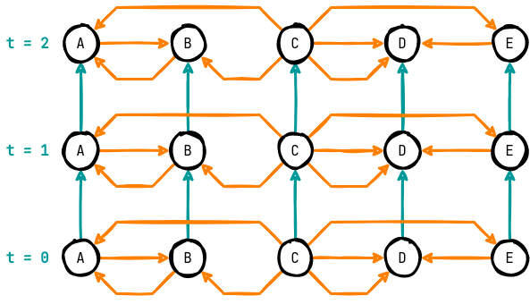
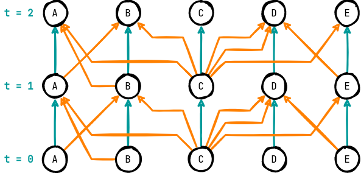
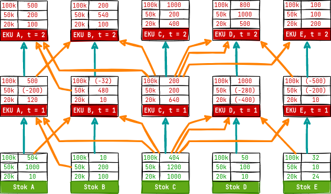

# <!-- fit --> Operasionalisasi Distribusi <br> Uang Rupiah Bank Indonesia

## Kreiton Sitorus

---

<!-- footer: 'Operasionalisasi Distribusi Uang Rupiah Bank Indonesia' -->

# <!-- fit --> Intro

---

## Pengelolaan uang rupiah sebagai rantai suplai
Pada dasarnya, pengelolaan uang rupiah adalah sebuah rantai suplai. Terdapat enam (6) aktivitas:
  - Perencanaan
  - Pencetakan
  - Pengeluaran 
  - Pengedaran
  - Pencabutan/Penarikan
  - Pemusnahan

---

## Pengedaran uang rupiah oleh DPU

Departemen Pengedaran Uang (DPU) bertanggung jawab untuk mendistribusikan uang rupiah yang diproduksi oleh PERURI. Tugas DPU adalah:

> Memastikan persediaan uang rupiah tiap khazanah cukup untuk memenuhi kebutuhan uang rupiah masyarakat di wilayah operasional.

---


---


---

## Pengendalian Inventori Konvensional

Perencanaan distribusi Bank Indonesia masih banyak menyerupai pengendalian inventori konvensional yang **didasari permintaan pelanggan** – yang pada kasus ini adalah **khazanah-khazanah** Bank Indonesia.

---

## Pengendalian Inventori Konvensional

Pendekatan ini mendikotomikan **manajemen inventori** dengan **manajemen transportasi** – dua komponen krusial dalam manajemen logistik dan menghambat optimasi sistem (Kleywegt, 2002)

---


---

## Integrasi Inventori dan Transportasi
- Konsep _vendor-managed inventory_ di mana pengisian ulang inventori di sejumlah lokasi dikendalikan oleh pengambil keputusan pusat – sebuah vendor. 
- Contohnya beragam, _e-commerce solutions_ memiliki subsistem ini di mana pelanggan-pelanggan menyerahkan pemenuhan inventori pada _fulfillment services_ pihak ketiga

---

## Integrasi Inventori dan Transportasi
Penerapan seperti ini memungkinkan **optimasi total** sistem distribusi, namun seiring bertambahnya ukuran jaringan, dibutuhkan **kemampuan komputasi untuk optimasi rencana distribusi** periodik lewat utilisasi informasi tingkat persediaan, kapasitas penyimpanan, estimasi permintaan, armada tersedia

---

## Sebuah Kerangka Kerja
Penelitian ini menjawab: 

> Bagaimana permasalahan operasionalisasi distribusi ini dapat dioptimasi melalui integrasi inventori dan transportasi?

Dikembangkan sebuah _framework_ yang mengutilisasi data-data jaringan untuk **mencari susunan pengiriman terbaik** yang **meminimasi biaya total** dan memastikan **persediaan selalu cukup** agar khazanah dapat **memenuhi kebutuhan** masyarakat

---

# <!-- fit --> Pemahaman <br> Masalah

---

## Analisis Pemangku Kepentingan (hlm. 20)

| Peran            | Entitas                                             |
| ---------------- | --------------------------------------------------- |
| Problem Owner    | DPU                                                 |
| Problem User     | DPU, penyedia moda transportasi, pengelola khazanah |
| Problem Customer | Bank komersial, masyarakat umum                     |
| Problem Analyst  | Peneliti                                            |

---

## Identifikasi Elemen Permasalahan (hlm. 21)

| Elemen              | Entitas                                                                                                                                                                                                                                                       |
| ------------------- | ------------------------------------------------------------------------------------------------------------------------------------------------------------------------------------------------------------------------------------------------------------- |
| Pengambil Keputusan | DPU                                                                                                                                                                                                                                                           |
| Objektif            | Pengedaran uang optimal                                                                                                                                                                                                                                       |
| Ukuran Performa     | Biaya total layanan, <br>Pemenuhan kebutuhan uang rupiah, <br> Utilisasi jaringan logistik (moda transportasi dan gudang penyimpanan)                                                                                                                         |
| Kriteria Keputusan  | Minimal, <br>Fisibel (semua kebutuhan terpenuhi), <br>Fisibel (mengikuti kapasitas gudang dan kapasitas terkait transportasi)                                                                                                                                 |
| Alternatif Tindakan | Semua kemungkinan **pasangan khazanah asal-tujuan**, **moda transportasi** yang digunakan, **besar muatan** uang yang dikirimkan, serta **kontainer** – atau satuan pengepakan lain – yang dibutuhkan untuk mengenkapsulasi uang yang dikirimkan              |
| Konteks             | **Narrow System of Interest**: sistem distribusi uang rupiah Bank Indonesia, **Wider System of Interest**: rantai suplai Bank Indonesia dengan produksi di PERURI, peramalan di Departemen Kebijakan Makroprudensial, beserta fungsi-fungsi lain yang terkait |

---

## Diagram Sistem Relevan (hlm. 23)

Dikembangkan dua diagram utk menangkap sistem relevan:
- Jaringan Terekspansi
- _Influence Diagram_

---


---



---



---



---


---

# <!-- fit --> Formulasi <br> Model

---

## Penyusunan Model (hlm. 28)
Umumnya disebut _inventory routing problem_, namun _inventory routing problem_ dapat didekati dengan ragam model – pada penelitian ini digunakan _min cost fixed-charge multicommodity network flow_ yang menyerupai jaringan terekspansi yang dibangun.

---

$$
\text{min } \displaystyle \text{obj}(\textbf{x},\textbf{y}) = \sum_{a \in A} \bigg[ var_{a} \cdot \sum_{p \in P} x_{a}^{p} + fix_a \cdot dist_a \cdot y_{a} \bigg]
$$


$$
\begin{array}{rrcll}
\text{s.t.} & \displaystyle \sum_{a \in \text{IN}(n)} x_{a}^{p} - \sum_{a \in \text{OUT}(n)} x_{a}^{p} & = & d_{n}^{p} 
                                                                       & \forall n \in N_{plan}, p \in P \\
     & \displaystyle \sum_{a \in \text{OUT}(n)} x_{a}^{p} & = & stock_{n}^{p} 
                                                                       & \forall n \in N_{init}, p \in P \\
     & \displaystyle \sum_{a \in \text{IN}(n)} x_{a}^{p} & = & sink_{n}^{p} 
                                                                       & \forall n \in N_{sink}, p \in P \\
     & \displaystyle \sum_{p \in P}x_{a}^{p} & \leq & Q_a \cdot y_a    & \forall a \in A
     
\end{array}
$$

---

$$
\begin{array}{rrcll}
& \displaystyle sink_{n}^{p} & \in & \mathbb{R}_{\geq0} & \forall n \in N_{sink}, p \in P\\
     & \displaystyle x_{a}^{p} & \in & \mathbb{R}_{\geq0}                  & \forall a \in A, p \in P \\
     & \displaystyle y_{a} & \in & \big[ 0,1 \big]                & \forall a \in A_{inv} \\
     & \displaystyle y_{a} & \in & \mathbb{N}_0                        & \forall a \in A_{trans}
\end{array}
$$

---

## Verifikasi Model (hlm. 31)

| Persamaan | Sisi Kiri          | Sisi Kanan                                                         |
| --------- | ------------------ | ------------------------------------------------------------------ |
| `4.1`     | Rupiah             | Rupiah/Peti * Peti + Rupiah/Kontainer/km * km * Kontainer = Rupiah |
| `4.2`     | Peti - Peti = Peti | Peti                                                               |
| `4.3`     | Peti               | Peti                                                               |
| `4.4`     | Peti               | Peti                                                               |
| `4.5`     | Peti               | Peti/Kontainer * Kontainer = Peti                                  |

---

# <!-- fit --> Pengembangan <br> Algoritma

---
- Digunakan paket pemodelan Julia Mathematical Programming dalam bahasa pemrograman Julia serta _solver_ Gurobi. Gurobi menggunakan _branch and cut_ sebagai metode utama dalam menyelesaikan permasalahan.
- Verifikasi algoritma dilakukan dengan tes-tes kecil:
  - Jika tidak ada permintaan, tidak ada pengiriman
  - Konsolidasi persediaan ke tempat yang membutuhkan
  - Dispersi persediaan ke tempat yang membutuhkan
  - Jika ada sumber yang lebih dekat, sumber tersebut yang melakukan pengiriman

---

# <!-- fit --> Pengujian <br>dan Analisis

---

## Kerangka Pengujian

Perlu dilakukan pengujian bagaimana model berperilaku -- terutama ketika dihadapkan dengan ketakpastian karena sifat model yang deterministik. Penggunaan model akan disimulasikan dan dijawab beberapa pertanyaan:

1. Apakah ada titik dalam ruang parameter model di mana perilaku di dunia nyata dapat diemulasi?
2. Bagaimana pengaruh akurasi ramalan terhadap performa model jangka panjang?
3. Bagaimana pengaruh perubahan parameter biaya terhadap struktur solusi?
4. Bagaimana pengaruh panjang horizon perencanaan terhadap performa model jangka panjang?
5. Bagaimana pengaruh struktur jaringan trayek yang tersedia terhadap performa model jangka panjang?

---

## Desain Simulasi (1)

Terdapat tiga entitas dalam simulasi:

- DPU sebagai _planner_ : Entitas ini memengaruhi tingkat persediaan khazanah dengan mengeksekusi distribusi setiap _timestep_ simulasi. **Atribut**: parameter-parameter optimasi beserta model perencanaan
- Masyarakat : Entitas ini memengaruhi tingkat persediaan khazanah dengan meminta aliran persediaan uang rupiah untuk keluar atau masuk. **Atribut**: realisasi kebutuhan uang pada periode tertentu
- Khazanah : Entitas yang dipengaruhi sepanjang simulasi. **Atribut**: tingkat persediaan, kapasitas, lokasi

---

## Desain Simulasi (2)

Inisialisasi simulasi:

```
Dimunculkan entitas-entitas khazanah
Tingkat persediaan khazanah ditetapkan untuk memulai simulasi
```

---

## Desain Simulasi (3)

_Events_ simulasi tiap _timestep_:
```
1. Plan
    DPU muncul, membaca atribut entitas-entitas khazanah, membuat rencana distribusi
2. Transport
    a. Rencana distribusi DPU dieksekusi 
    b. Tingkat persediaan tiap khazanah diubah sesuai distribusi yang dilakukan. 
    c. Entitas DPU untuk periode ini dibebaskan.
3. Fulfill
    a. Masyarakat muncul dan menyampaikan permintaan
    b. Tiap-tiap khazanah memenuhi permintaan sesuai dengan ketersediaan masing-masing
```

---

## Akurasi Ramalan
- Model sensitif terhadap ramalan, dengan rata-rata kenaikan harga sebesar **Rp9.595 per simpangan satu (1) peti** dengan simpangan baku Rp4.846 (120 simulasi -- dua fungsi realisasi)
- Untuk memberikan konteks, dengan data yang digunakan, simpangan 5% dari realisasi (jarak _L1-norm_ antara ramalan dengan realisasi) diekspektasikan menaikkan biaya total sebesar ~3%

---

## Parameter Biaya
Dengan menggunakan Jaccard Similarity Measure, ditemukan bahwa secara pilihan lokasi kesamaan solusi tidak lebih rendah dari 70% untuk simpangan biaya Rp2.000 tiap moda dan komponen biaya.

---

## Struktur Jaringan

Mempertimbangkan lebih banyak trayek memberikan hasil yang lebih baik valid untuk _optimality gap_ tertentu ($\leq$ 20%) -- setelah panjang horizon tertentu ($\geq$ 4).

---

## Horizon Perencanaan

Pada _optimality gap_ yang lebih besar, penurunan biaya total layanan menjadi tidak monoton. Penurunan biaya total layanan dari $H=1$ s.d. $H=6$ adalah:

- $16.0\%$ utk $GAP$ = 59%
- $28.2\%$ utk $GAP$ = 20%
- $39.2\%$ utk $GAP$ = 8%

Di mana tiap-tiap _optimality gap_ memiliki biaya total layanan berbeda pada $H=1$.

---


---

## Performa Aktual

Terdapat aktivitas pengiriman selama tahun 2019 dan aktivitas tersebut dapat diemulasi dengan menggunakan model yang dimodifikasi untuk mengizinkan _overloading_ kapasitas khazanah, _optimality gap_ 60%, dan panjang horizon perencanaan $H = 1$ atau $H=2$

---

# <!-- fit --> Kesimpulan <br>dan Saran

---

- Sebagai kerangka kerja optimasi, model dan algoritma optimasi/aproksimasi adalah layak untuk digunakan
- Bentuk jaringan terekspansi merupakan sasaran empuk untuk ekstensi model:
  - _Produksi (w. fixed-charge)_ --> titik tambahan yang dapat membuat aliran (semacam surplus untuk persediaan)
  - _Fixed Charged Warehouse_ --> beri nilai parameter biaya tetap untuk busur inventori
  - _Fleet Variance_ --> konstruksi jaringan dapat dimodifikasi untuk mempertimbangkan trayek yang berbeda tiap periode

---

> A model <br>is only as good <br>as its data.

---

# <!-- fit --> Terima <br> Kasih


