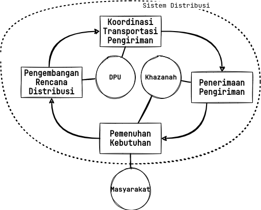
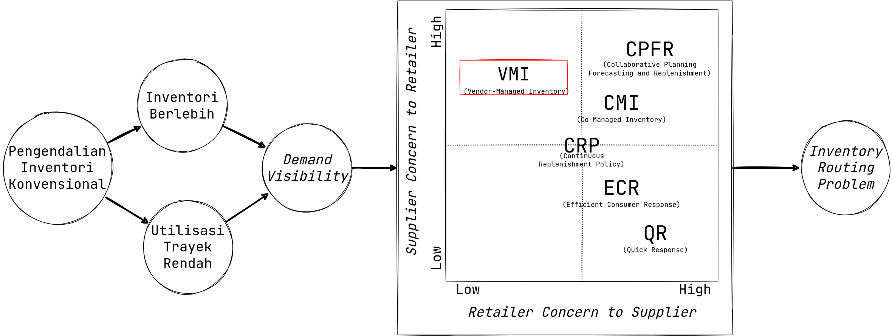

# <!-- fit --> Perencanaan Distribusi   Uang Rupiah Bank Indonesia

## Kreiton Sitorus (13416006)

---

<!-- footer: 'Operasionalisasi Distribusi Uang Rupiah Bank Indonesia' -->

# <!-- fit --> Pendahuluan

---

## Pengelolaan uang rupiah sebagai rantai suplai
Pada dasarnya, pengelolaan uang rupiah adalah sebuah rantai suplai. Terdapat enam (6) aktivitas:
  - Perencanaan
  - Pencetakan
  - Pengeluaran 
  - Pengedaran
  - Pencabutan/Penarikan
  - Pemusnahan

---

## Pengedaran uang rupiah oleh _Command Center_ DPU

Departemen Pengedaran Uang (DPU) bertanggung jawab untuk mendistribusikan uang rupiah yang diproduksi oleh PERURI. Tugas DPU adalah:

> Memastikan persediaan uang rupiah tiap khazanah cukup untuk memenuhi kebutuhan uang rupiah masyarakat di wilayah operasional.

---

---

---

| Asal      | Tujuan   | Moda   | Muatan                                                          | Kontainer |
| --------- | -------- | ------ | --------------------------------------------------------------- | --------- |
| Jakarta   | Medan    | Kapal  | Rp50k : 1000 peti    Rp20k : 2000 peti   Rp10k : 500 peti | 1         |
| Samarinda | Palu     | Truk   | Rp50k : 200 peti   Rp20k : 50 peti   Rp10k : 0 peti       | 1         |
| Jakarta   | Surabaya | Kereta | Rp50k : 2000 peti   Rp20k : 1000 peti   Rp10k : 1000 peti | 2         |

---

## Pengendalian Inventori Konvensional

Perencanaan distribusi Bank Indonesia masih banyak menyerupai pengendalian inventori konvensional yang **didasari permintaan pelanggan** – yang pada kasus ini adalah **khazanah-khazanah** Bank Indonesia.

---

## Pengendalian Inventori Konvensional

Pendekatan ini mendikotomikan **manajemen inventori** dengan **manajemen transportasi** – dua komponen krusial dalam manajemen logistik dan menghambat optimasi sistem (Kleywegt, 2002)

---

---

---

## _Vendor-managed Inventory_
- _Vendor-managed inventory_ adalah sebuah konsep di mana pengisian ulang inventori di sejumlah lokasi dikendalikan oleh pengambil keputusan pusat – sebuah vendor.
- Salah satu permasalahan inti dari konsep ini adalah _inventory routing problem_ yang didefinisikan sebagai:

> Distribusi berulang komoditas (pengiriman dengan jumlah tertentu) dari fasilitas penyedia ke fasilitas penerima melalui armada yang ada untuk memastikan ketersediaan komoditas dengan biaya minimal sepanjang periode perencanaan yang ditetapkan (Campbell et al., 1998).

---

## Rumusan Masalah
Penelitian ini menjawab: 

> Bagaimana perencanaan distribusi uang rupiah Bank Indonesia dioptimasi melalui penyelesaian inventory routing problem?

Dikembangkan sebuah skema yang mengutilisasi data-data jaringan untuk **mencari rencana distribusi terbaik** yang **meminimasi biaya total** dan memastikan **persediaan selalu cukup** agar khazanah dapat **memenuhi kebutuhan** masyarakat.

---

## Metodologi

Dikembangkan jaringan terekspansi waktu sebagai representasi permasalahan. Kemudian, representasi tersebut diformulasikan sebagai pemrograman integer campuran yang diselesaikan dengan aproksimasi _optimality gap_. Penggunaan model dan algoritma dalam kerangka _rolling horizon_ diujikan dalam sebuah studi simulasi.

---

## Pemahaman Masalah

Permasalahan didefinisikan di atas jaringan yang terdiri dari kumpulan khazanah, trayek yang menghubungkan, serta moda transportasi untuk tiap trayek.

---

### Khazanah

| Nama       | Lokasi           | Kapasitas |
| ---------- | ---------------- | --------- |
| Jakarta    | (0.5334, 3.207)  | 14192     |
| Bandung    | (-0.692, -1.373) | 711       |
| Surabaya   | (-0.885, -3.635) | 2729      |
| Yogyakarta | (-1.123,3.348)   | 1207      |
| Cirebon    | (-0.464, 1.296)  | 960       |

---

### Trayek

| Asal    | Tujuan     | Moda   |
| ------- | ---------- | ------ |
| Jakarta | Yogyakarta | Truk   |
| Jakarta | Yogyakarta | Kereta |
| Jakarta | Cirebon    | Truk   |
| Cirebon | Jakarta    | Truk   |
| Bandung | Surabaya   | Kereta |
| Bandung | Cirebon    | Truk   |

---

### Moda

| Nama   | Kapasitas (peti/kontainer) | Biaya Variabel (Rp/peti) | Biaya Tetap (Rp/km/kontainer) |
| ------ | -------------------------- | ------------------------ | ----------------------------- |
| Truk   | 500                        | 48.000                   | 45.000                        |
| Kereta | 1200                       | 60.000                   | 32.000                        |

---

---

---

### Tingkat Persediaan

| Khazanah | Pecahan | Persediaan (peti) | Nilai Ekuivalen (Rp( |
| -------- | ------- | ----------------- | -------------------- |
| Jakarta  | Rp50k   | 378,79            | 378 miliar           |
| Bandung  | Rp20k   | 394,07            | 157,6 miliar         |
| Surabaya | Rp20k   | 51,61             | 20,6 miliar          |

---

### (Estimasi) Permintaan

| Khazanah | Pecahan | Periode | Kebutuhan (peti) | Nilai Ekuivalen (rupiah) |
| -------- | ------- | ------- | ---------------- | ------------------------ |
| Jakarta  | Rp50k   | 1       | 37,74            | 37,74 miliar             |
| Jakarta  | Rp50k   | 2       | -89,19           | -89,19 miliar            |
| Jakarta  | Rp20k   | 1       | 387,75           | 155,1 miliar             |
| Jakarta  | Rp20k   | 2       | 148,29           | 59,32 miliar             |
| Bandung  | Rp50k   | 1       | -60,70           | -60,70 miliar            |
| Bandung  | Rp20k   | 1       | -35,92           | -14,37 miliar            |

---

---

---

