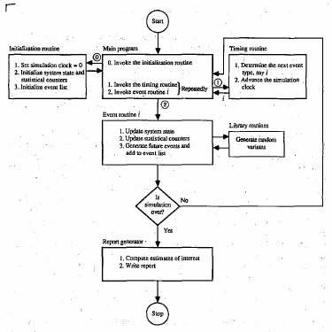

# simulasi
ID: 20220317155345

kykny harus cari2 dikit tentang cara ngembangin simulasi (?)

```julia
for t in periods
    replenishment = planDispatch(
        khazanah.invLevel, khazanah.capacity
        estimDemand(t=>planningHorizon), 
        existingTrips
    )
    realization = execute!(khazanah,replenishment)
    append!(output, realization) # all arc from t to t+1
    fulfillDemand!(khazanah, realDemand[t])
end                             
```

the main point of the simulation is to follow the diagram persis kyk yg ada di [[20220317160430]] BAB 1 PENDAHULUAN: bikin rencana pengiriman berdasar estimasi demand dan jaringan transportnya, terus eksekusi deh si rencananya dan terupdate semua tingkat persediaan.

di bagian eksekusi perlu diperhatiin nih workflownya dan di basgian ini kyknya semua data diambil dan dioutput jadi realisasi distribusinya.

```julia
function execute!(khazanah, replenishment)
    for k in khazanah
        k.invLevel = sum(r.value for r in replenishment(:,k)) + k.invLevel # new inv level
    end
    return outputData
end     
```

klo dari [[20220317161243]] BAB 5 PENGUJIAN DAN ANALISIS salah satu parameter global simulasinya adalah panjang horizon perencanaan sama panjang rolling horizonnya


Params: step, planning horizon, rolling horizon

Accumulators: dispatch (planned + realized), inventory level, demand realization (asked + fulfilled)

START
while timestep ≤ step
- dispatch planner plans dispatch if needed (check planned dispatch not empty)
- planned dispatch starts execution (execute inventory reduction on dispatch's source) → track unfulfilled dispatch
- planned dispatch ends execution (execute inventory addition on dispatch's targets) → track capacity overload
- demand realized (execute inventory transfer to customer) → track lost sales
- timestep + 1
STOP

ngikutin [@law1991], komponen simulasi ada beberapa, yaitu:
 - system state
 - simulation clock
 - event list
 - statistical counters (accumulators klo di buku yg lainnya)
 - initialization routine
 - timing routine
 - event routine
 - library routine
 - report generator
 - main program



detail teknisnya dilanjut di [[20220401093905]] jurnal 1 April 2022


